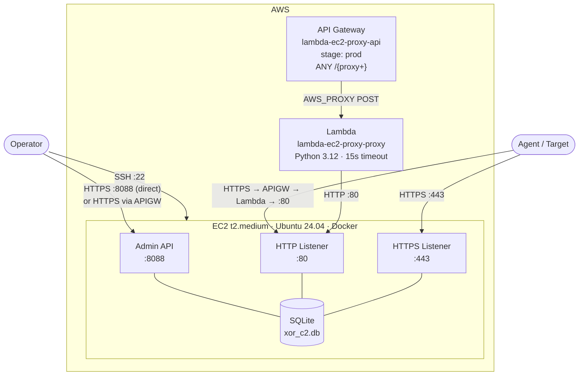
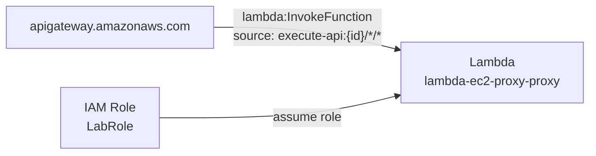
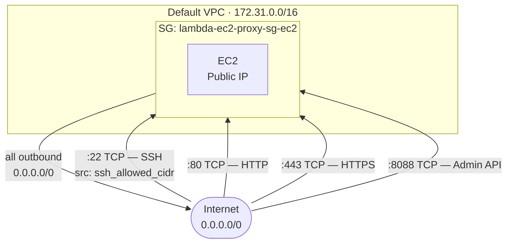
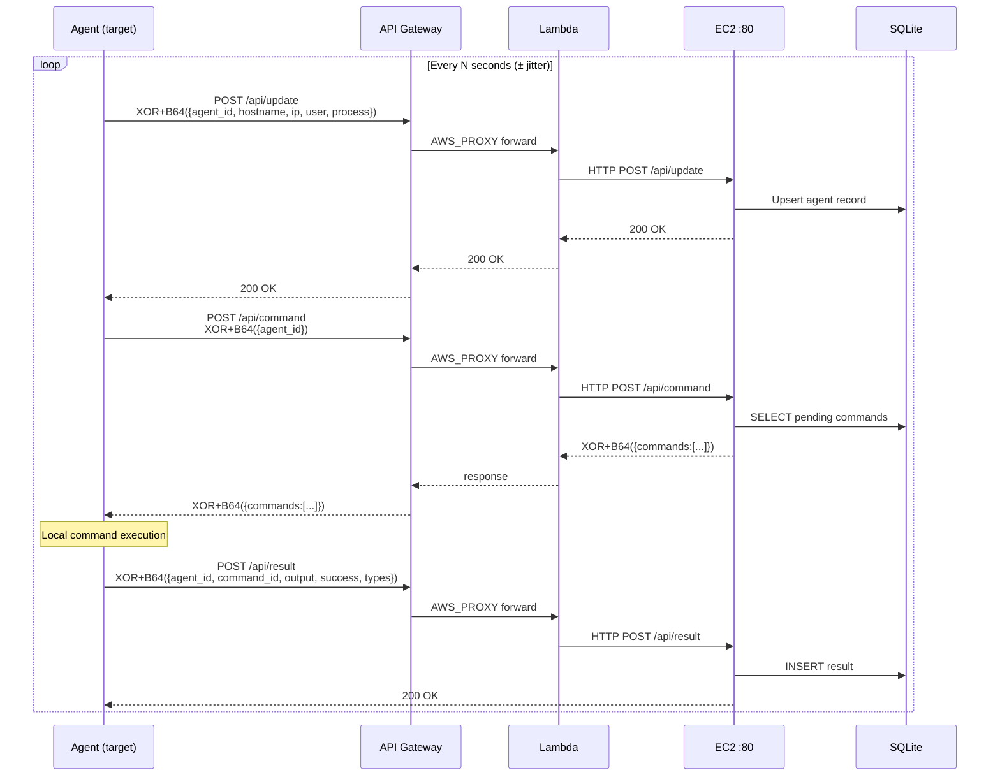
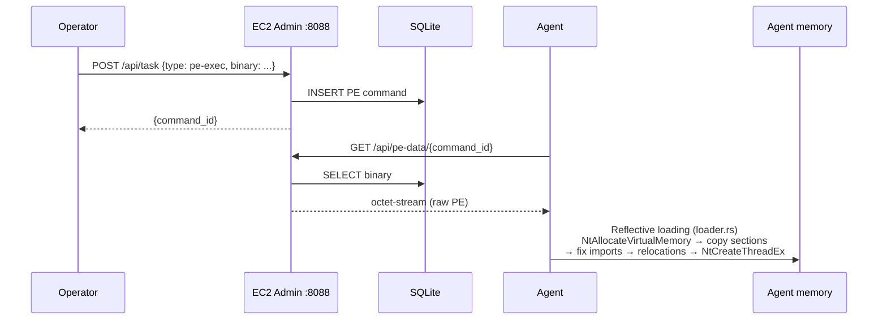
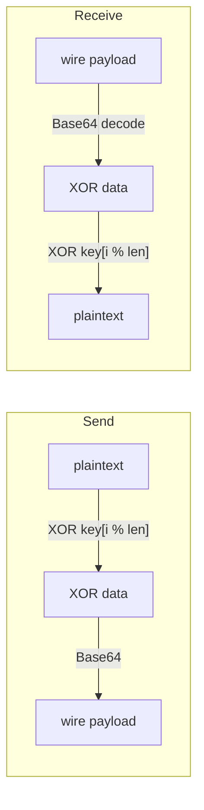

# AWS Infrastructure — XOR-C2

## Overview

---

## AWS Components

### EC2

| Attribute | Value |
|---|---|
| Type | `t2.medium` |
| AMI | Ubuntu 24.04 LTS (`ami-0e86e20dae9224db8`, us-east-1) |
| Region | `us-east-1` |
| Network | Default VPC, assigned public IP |
| Key pair | `redteam` |
| Name | `lambda-ec2-proxy-backend` |

The C2 server runs inside a Docker container exposing ports 80, 443, 8088, and 8443.

### API Gateway

| Attribute | Value |
|---|---|
| Name | `lambda-ec2-proxy-api` |
| Stage | `prod` |
| Resource | `/{proxy+}` — catch-all |
| Methods | `ANY` (all HTTP verbs) |
| Integration | `AWS_PROXY` → Lambda |
| Authentication | None (public) |
| URL | `https://{api_id}.execute-api.us-east-1.amazonaws.com/prod/` |

### Lambda

| Attribute | Value |
|---|---|
| Name | `lambda-ec2-proxy-proxy` |
| Runtime | Python 3.12 |
| Timeout | 15 s (10 s for internal HTTP requests) |
| IAM Role | `LabRole` (pre-existing) |
| Env variable | `EC2_URL = http://{EC2_PUBLIC_IP}:80` |

---

## IAM & Permissions

| Principal | Action | Resource |
|---|---|---|
| `apigateway.amazonaws.com` | `lambda:InvokeFunction` | `function:lambda-ec2-proxy-proxy` |
| `LabRole` | Learner Lab permissions (EC2, Lambda, APIGW) | — |

Only the API Gateway is explicitly allowed to invoke the Lambda. No other resource holds invocation rights.

---

## Network & Security Group

### Network topology

### Inbound rules

| Port | Proto | Source | Purpose |
|---|---|---|---|
| 22 | TCP | `var.ssh_allowed_cidr` (default `0.0.0.0/0`) | Operator SSH |
| 80 | TCP | `0.0.0.0/0` | Agent HTTP listener + Lambda relay |
| 443 | TCP | `0.0.0.0/0` | Agent HTTPS listener |
| 8088 | TCP | `0.0.0.0/0` | Operator Admin API |

### Outbound rules

| Port | Proto | Destination |
|---|---|---|
| All | All | `0.0.0.0/0` |

---

## Agent ↔ C2 Traffic Flow

### Full beacon cycle

### In-memory binary execution (PE-Exec)

### Channel encryption

The XOR key is injected at agent compile time and must match the key configured on the C2 listener side.

---

## C2 Server Ports (EC2)

| Port | Service | Consumers |
|---|---|---|
| 8088 | Admin REST API (login, generate, task, results, victims) | Operator |
| 80 | HTTP agent listener | Agents via Lambda relay or direct |
| 443 | HTTPS agent listener | Agents (direct) |
| 8443 | Alternate HTTPS listener | Agents (direct) |

---

## Terraform Outputs

| Output | Description |
|---|---|
| `api_gateway_url` | Public entry point URL for agents |
| `ec2_public_ip` | EC2 public IP (SSH + direct admin) |
| `ec2_private_ip` | EC2 private IP |
| `lambda_function_name` | Lambda proxy function name |
