# XOR C2 Packer — Documentation technique

## Vue d'ensemble

Le packer est un outil Rust composé de deux parties distinctes :

- **`packer-cli`** : l'outil de packing (côté builder), qui prend un PE en entrée et produit un binaire protégé.
- **`stub`** : le loader embarqué (pré-compilé séparément), qui sera exécuté au moment du lancement et qui reconstruit le PE original en mémoire.

---

## Pipeline de packing

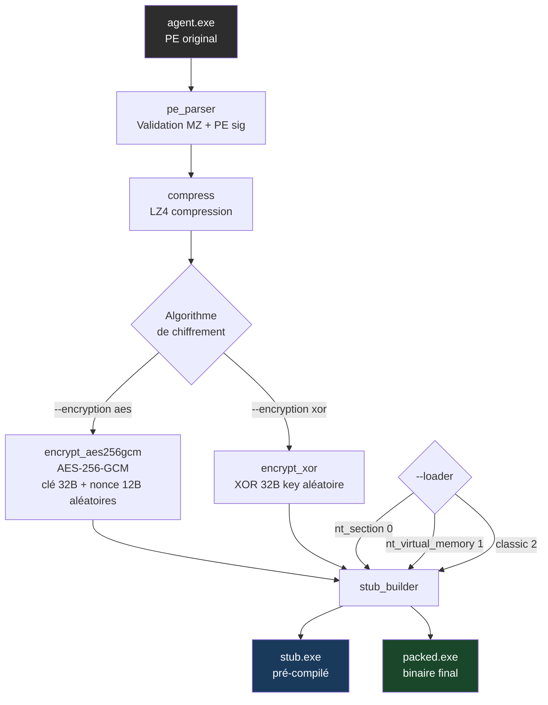

---

## Structure du binaire final

Le binaire produit est une concaténation de trois blocs :

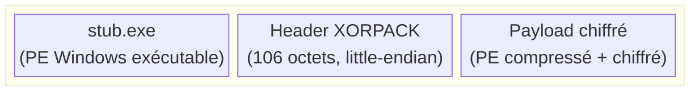

### Détail du header (106 octets)

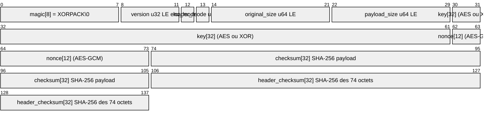

> Le magic `XORPACK\x00` permet au stub de localiser l'overlay en fin de fichier.

---

## Algorithmes de chiffrement

### AES-256-GCM (défaut)

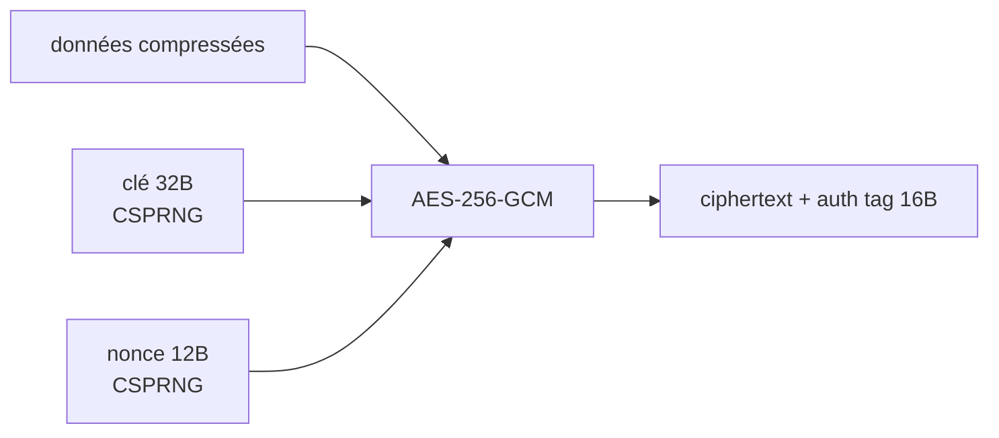

- Clé et nonce générés aléatoirement via `rand::thread_rng()`
- Le tag d'authentification GCM est inclus dans le ciphertext
- Fournit confidentialité **et** intégrité

### XOR (mode alternatif)

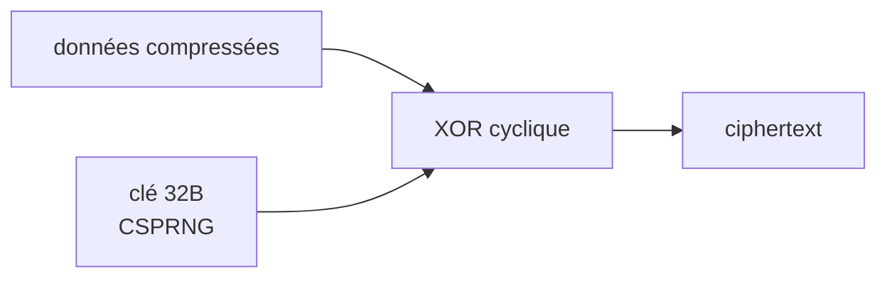

- XOR cyclique sur 32 octets : `byte[i] ^ key[i % 32]`
- Nonce = `[0u8; 12]` (non utilisé)
- Moins robuste, présent comme alternative légère

---

## Intégrité et vérifications

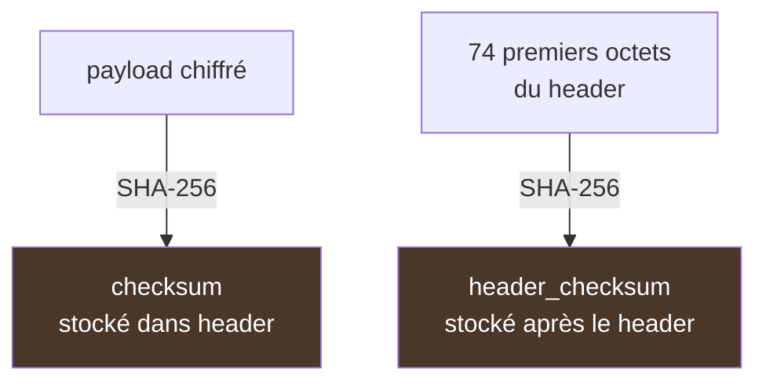

Deux niveaux de vérification SHA-256 :
1. **`checksum`** : intégrité du payload chiffré
2. **`header_checksum`** : intégrité du header lui-même (anti-tamper)

---

## Le Loader (stub) — fonctionnement détaillé

Le stub est un PE Windows autonome (`#![windows_subsystem = "windows"]`) compilé séparément. Il joue le rôle de loader réflectif : il reconstruit et exécute le PE original entièrement en mémoire, sans jamais le poser sur disque.

### Vue d'ensemble du stub

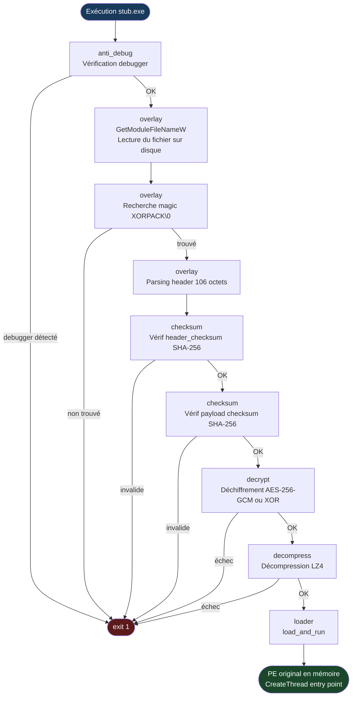

---

### Anti-debug (`anti_debug.rs`)

Avant toute opération, le stub vérifie qu'il n'est pas analysé dans un debugger via deux méthodes complémentaires :

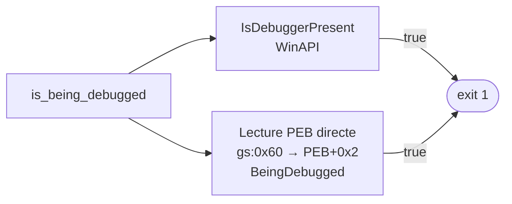

| Méthode | Mécanisme |
|---|---|
| `IsDebuggerPresent()` | WinAPI standard, consulte `PEB->BeingDebugged` |
| Lecture PEB inline ASM | `gs:[0x60]` → pointeur PEB, lecture de `PEB+0x2` directement en assembleur x86-64 |

Les deux méthodes consultent in fine le même flag `BeingDebugged` du PEB mais par des chemins différents : l'une passe par la WinAPI (hookable), l'autre lit directement le segment GS via `asm!` (plus difficile à intercepter).

---

### Localisation de l'overlay (`overlay.rs`)

Le stub se lit lui-même depuis le disque pour localiser ses données embarquées :

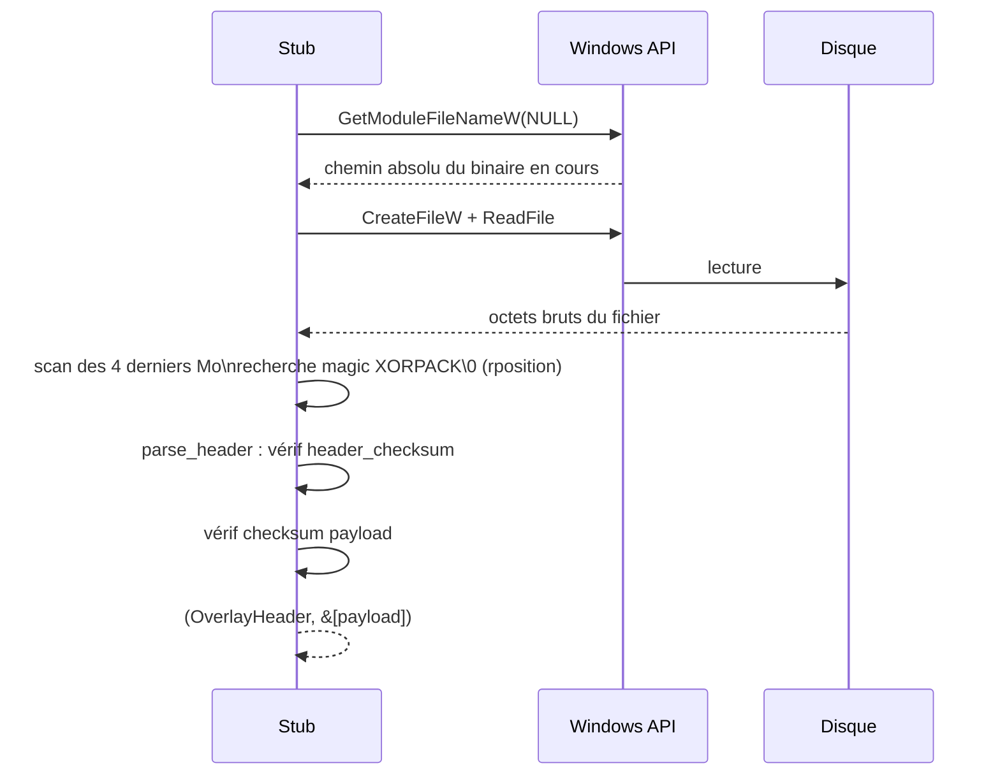

**Détail de la recherche du magic** : la recherche part de la fin du fichier (limitée aux 4 derniers Mo) avec `rposition` — c'est plus efficace car l'overlay est toujours en fin de fichier. Si le `header_checksum` ou le `checksum` du payload ne correspond pas, le stub termine silencieusement (`exit 1`).

---

### Loader PE réflectif (`loader.rs`)

C'est la partie centrale : charger et exécuter un PE64 depuis un buffer mémoire, sans passer par le chargeur Windows standard (`LoadLibrary`). Le loader est sélectionné via le champ `loader_mode` de l'overlay header, défini au moment du packing avec `--loader`.

#### Sélection du loader

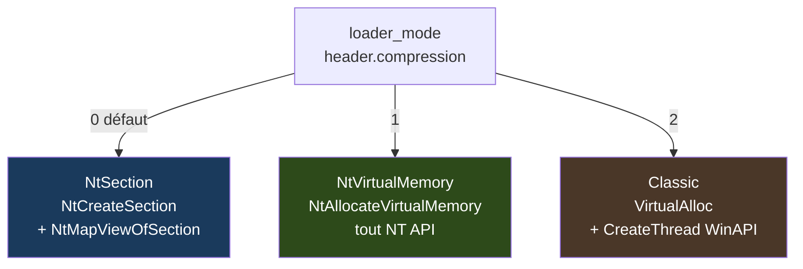

| Valeur | Variante | Allocation | Thread | Fix imports | Type mémoire |
|--------|----------|-----------|--------|-------------|--------------|
| `0` | `NtSection` | `NtCreateSection` + `NtMapViewOfSection` | `NtCreateThreadEx` | `LdrLoadDll` + `LdrGetProcedureAddress` | `MEM_MAPPED` |
| `1` | `NtVirtualMemory` | `NtAllocateVirtualMemory` | `NtCreateThreadEx` | `LdrLoadDll` + `LdrGetProcedureAddress` | `MEM_PRIVATE` |
| `2` | `Classic` | `VirtualAlloc` | `CreateThread` | `LoadLibraryA` + `GetProcAddress` | `MEM_PRIVATE` |

**`NtSection` (0)** — La région est de type `MEM_MAPPED` (comme une DLL normale) plutôt que `MEM_PRIVATE`, ce qui rend le scan mémoire plus discret. Toutes les résolutions passent par des fonctions NT indirectes sans passer par les stubs de la WinAPI haute couche.

**`NtVirtualMemory` (1)** — Allocation via `NtAllocateVirtualMemory` (syscall NT direct), résolution des imports via `LdrLoadDll`/`LdrGetProcedureAddress`. Évite `VirtualAlloc` qui est souvent hookée par les EDR.

**`Classic` (2)** — Approche standard : `VirtualAlloc`, `LoadLibraryA`, `GetProcAddress`, `CreateThread`. Compatible maximale, mais plus détectable.

#### Pipeline commun aux 3 loaders

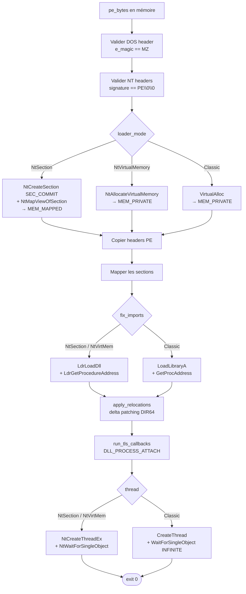

#### Étape fix imports — détail NT (`NtSection` / `NtVirtualMemory`)

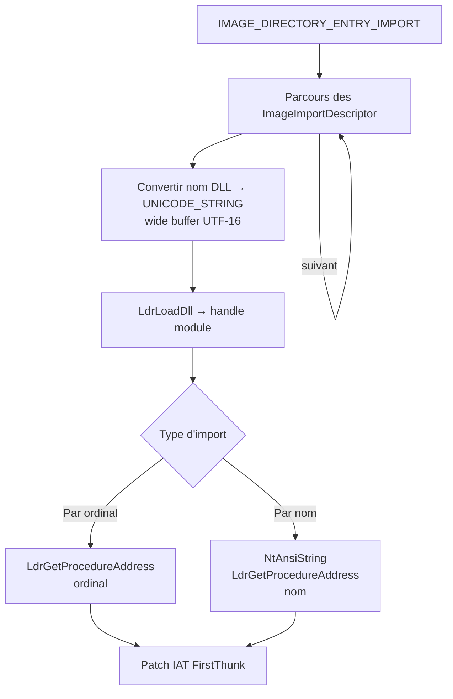

#### Étape fix imports — détail Classic

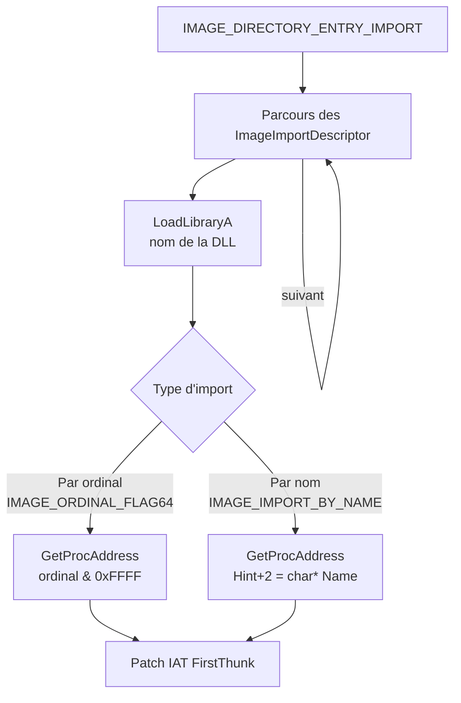

- Fallback : si `OriginalFirstThunk == 0` (cas MinGW/certains linkers), utilise `FirstThunk` comme source

#### Étape 7 — Relocations (`apply_relocations`)

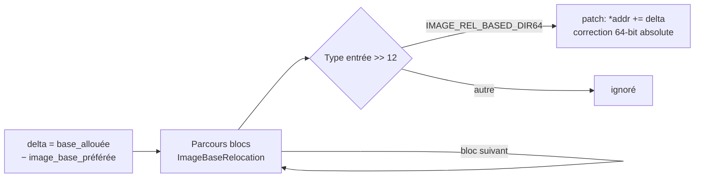

Si le PE n'est pas chargé à son `ImageBase` préféré, toutes les adresses absolues encodées dans la table de relocations sont corrigées en ajoutant `delta`.

#### Étape 8 — TLS Callbacks (`run_tls_callbacks`)

Si le PE déclare une section TLS avec des callbacks (`IMAGE_DIRECTORY_ENTRY_TLS`), ceux-ci sont appelés avec `DLL_PROCESS_ATTACH` avant le lancement de l'entry point — comportement identique au chargeur Windows natif.

#### Étape 9 — Exécution


L'entry point est lancé dans un nouveau thread via `CreateThread` (avec `transmute` de l'adresse), le stub attend sa fin avec `WaitForSingleObject(INFINITE)`.

---

### Séquence complète packing → exécution

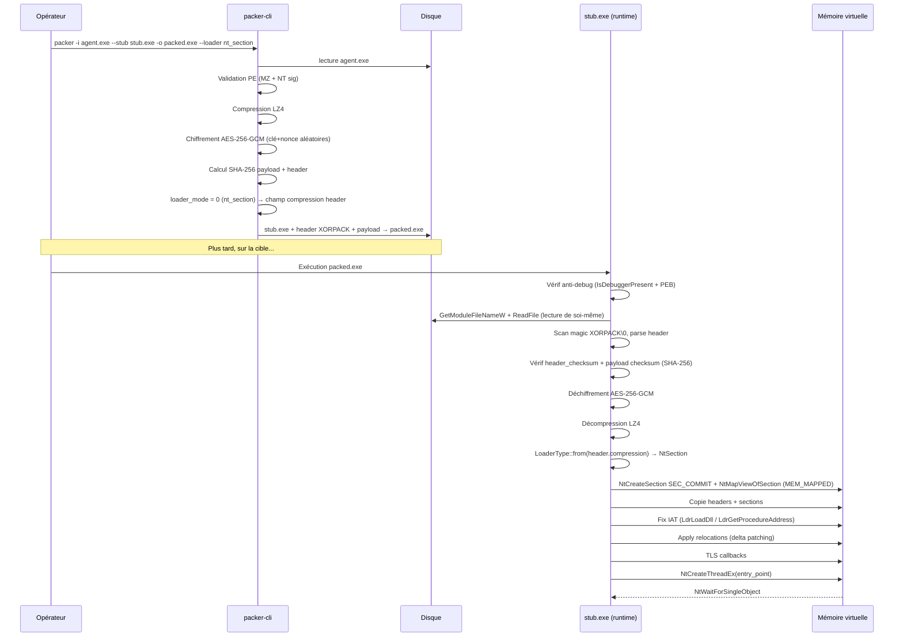

---

## Structure des sources (mise à jour)

```
packer/
├── packer-cli/          # Outil de packing (Rust)
│   └── src/
│       ├── main.rs          # Point d'entrée CLI (clap)
│       ├── pe_parser.rs     # Validation signature MZ + PE
│       ├── compress.rs      # Compression LZ4 (lz4_flex)
│       ├── encrypt.rs       # AES-256-GCM + XOR
│       ├── checksum.rs      # SHA-256 (sha2)
│       └── stub_builder.rs  # Assemblage final + sérialisation header
└── stub/                # Loader runtime (Rust, compilé séparément)
    └── src/
        ├── main.rs          # Orchestration : anti-debug → overlay → decrypt → load
        ├── anti_debug.rs    # IsDebuggerPresent + lecture PEB (asm x86-64)
        ├── overlay.rs       # Lecture du fichier, scan magic, parse + vérif header
        ├── decrypt.rs       # Déchiffrement AES-256-GCM + XOR
        ├── decompress.rs    # Décompression LZ4
        ├── checksum.rs      # SHA-256 compute + verify
        └── loader.rs        # 3 loaders PE réflectifs : NtSection / NtVirtualMemory / Classic
```

---

## Usage CLI

```
packer --input agent.exe --stub stub.exe --output packed.exe [--encryption aes|xor] [--loader nt_section|nt_virtual_memory|classic]
```

| Argument | Description | Défaut |
|---|---|---|
| `-i, --input` | PE d'entrée à protéger | — |
| `-o, --output` | Fichier de sortie | — |
| `--stub` | Stub Windows pré-compilé | — |
| `-e, --encryption` | Algorithme : `aes` ou `xor` | `aes` |
| `--loader` | Technique de chargement en mémoire : `nt_section`, `nt_virtual_memory` ou `classic` | `nt_virtual_memory` |

### Exemples

```bash
# Loader NT section (MEM_MAPPED, le plus discret)
cargo run -p packer-cli -- -i agent.exe --stub stub.exe -o packed.exe --loader nt_section

# Loader NT VirtualMemory (NtAllocateVirtualMemory, évite les hooks EDR sur VirtualAlloc)
cargo run -p packer-cli -- -i agent.exe --stub stub.exe -o packed.exe --loader nt_virtual_memory

# Loader classique (VirtualAlloc + CreateThread, compatibilité maximale)
cargo run -p packer-cli -- -i agent.exe --stub stub.exe -o packed.exe --loader classic --encryption xor
```

---

## Dépendances

| Crate | Version | Rôle |
|---|---|---|
| `clap` | 4 | Parsing des arguments CLI |
| `aes-gcm` | 0.10 | Chiffrement AES-256-GCM |
| `sha2` | 0.10 | Calcul SHA-256 (intégrité) |
| `lz4_flex` | 0.11 | Compression/décompression LZ4 |
| `rand` | 0.8 | Génération aléatoire clé/nonce |
| `anyhow` | 1 | Gestion d'erreurs |
