# XOR C2 Packer — Technical Documentation

## Overview

The packer is a Rust tool composed of two distinct parts:

- **`packer-cli`**: the packing tool (builder side), which takes a PE as input and produces a protected binary.
- **`stub`**: the embedded loader (pre-compiled separately), which is executed at launch time and reconstructs the original PE in memory.

---

## Packing Pipeline

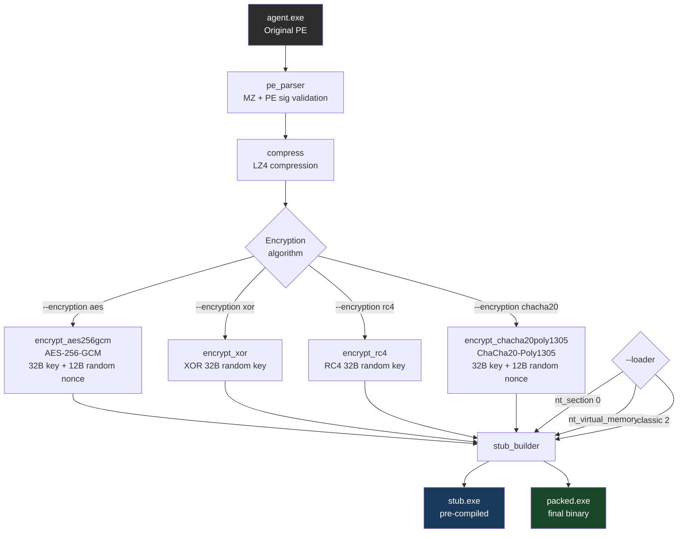

---

## Final Binary Structure

The produced binary is a concatenation of three blocks:

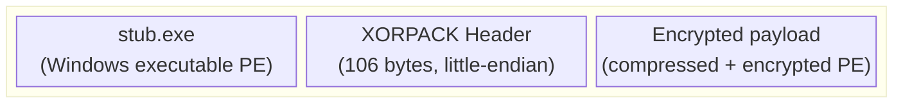

### Header detail (106 bytes)

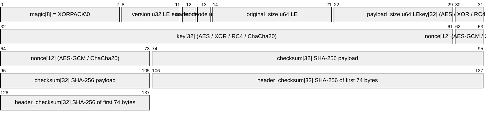

> The magic `XORPACK\x00` allows the stub to locate the overlay at the end of the file.

---

## Encryption Algorithms

### AES-256-GCM

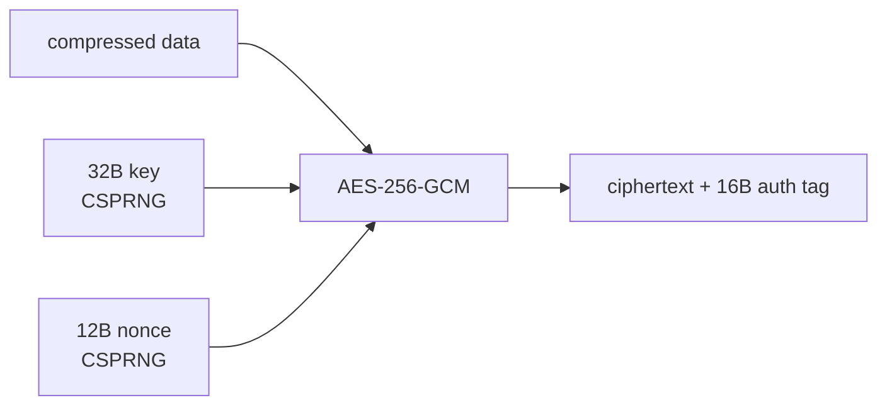

- Key and nonce randomly generated via `rand::thread_rng()`
- GCM authentication tag included in the ciphertext
- Provides both confidentiality **and** integrity

### XOR

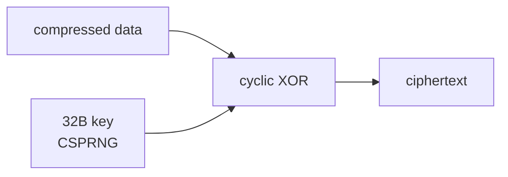

- Cyclic XOR over 32 bytes: `byte[i] ^ key[i % 32]`
- Nonce = `[0u8; 12]` (unused)
- Lightweight alternative, less robust

### RC4

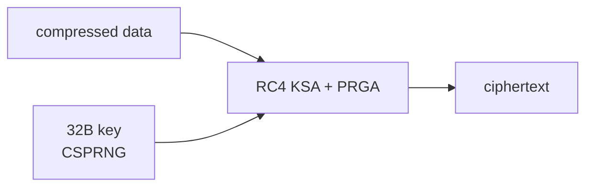

- Standard RC4 stream cipher (KSA + PRGA), implemented inline (no external crate)
- Nonce = `[0u8; 12]` (unused)
- Fast, symmetric — decryption is the same operation as encryption

### ChaCha20-Poly1305

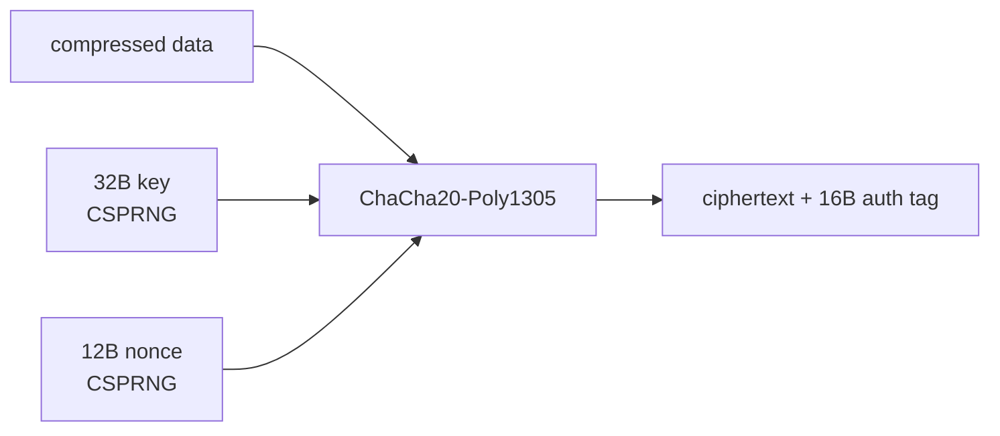

- Key and nonce randomly generated via `rand::thread_rng()`
- Poly1305 authentication tag included in the ciphertext
- Provides both confidentiality **and** integrity
- Fast in software (no AES hardware requirement)

### Encryption mode summary

| Mode | Value | Algorithm | Integrity | Nonce used |
|------|-------|-----------|-----------|------------|
| `xor` | `0` | Cyclic XOR 32B | No | No |
| `aes` | `1` | AES-256-GCM | Yes (GCM tag) | Yes |
| `rc4` | `2` | RC4 stream cipher | No | No |
| `chacha20` | `3` | ChaCha20-Poly1305 | Yes (Poly1305) | Yes |

---

## Integrity Checks

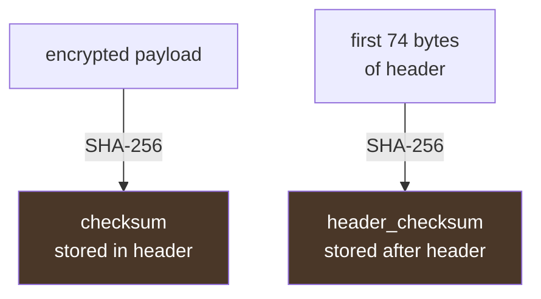

Two levels of SHA-256 verification:
1. **`checksum`**: integrity of the encrypted payload
2. **`header_checksum`**: integrity of the header itself (anti-tamper)

---

## The Loader (stub) — Detailed Operation

The stub is a standalone Windows PE (`#![windows_subsystem = "windows"]`) compiled separately. It acts as a reflective loader: it reconstructs and executes the original PE entirely in memory, without ever writing it to disk.

### Stub overview


---

### Anti-debug (`anti_debug.rs`)

Before any operation, the stub checks that it is not being analyzed in a debugger via two complementary methods:

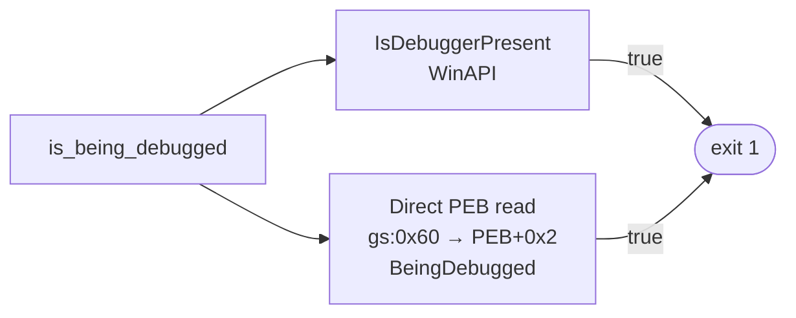

| Method | Mechanism |
|--------|-----------|
| `IsDebuggerPresent()` | Standard WinAPI, reads `PEB->BeingDebugged` |
| Inline ASM PEB read | `gs:[0x60]` → PEB pointer, reads `PEB+0x2` directly via x86-64 `asm!` |

Both methods ultimately check the same `BeingDebugged` flag in the PEB but via different paths: one goes through the WinAPI (hookable), the other reads the GS segment directly (harder to intercept).

---

### Overlay location (`overlay.rs`)

The stub reads itself from disk to locate its embedded data:

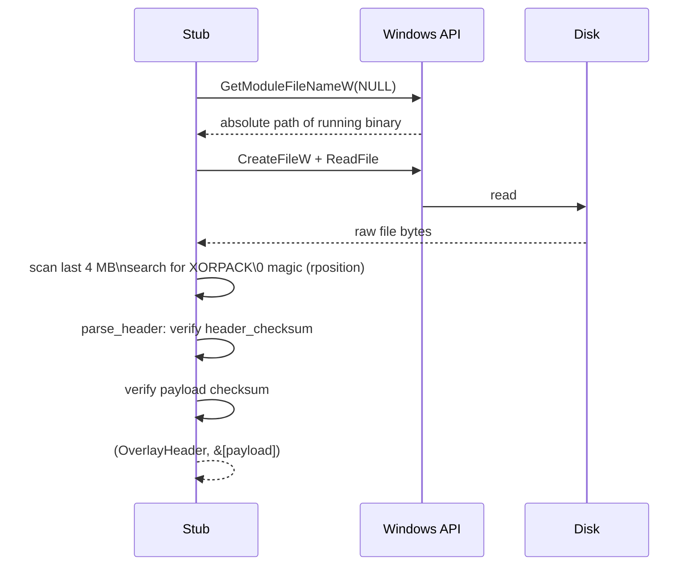

**Magic search detail**: the search starts from the end of the file (limited to the last 4 MB) using `rposition` — more efficient since the overlay is always at the end. If `header_checksum` or payload `checksum` does not match, the stub exits silently (`exit 1`).

---

### Reflective PE Loader (`loader.rs`)

This is the core component: loading and executing a PE64 from a memory buffer, without going through the standard Windows loader (`LoadLibrary`). The loader is selected via the `loader_mode` field in the overlay header, set at packing time with `--loader`.

#### Loader selection

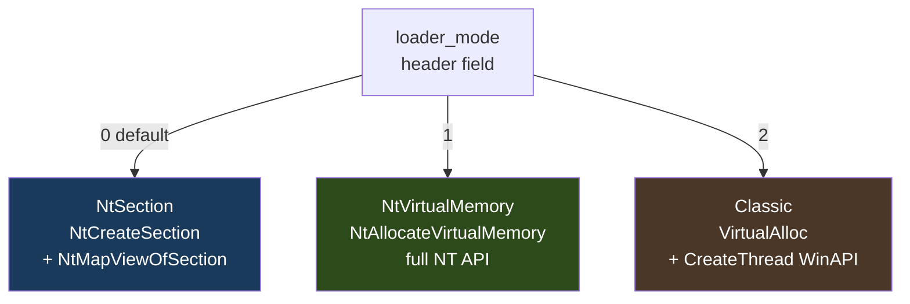

| Value | Variant | Allocation | Thread | Import fix | Memory type |
|-------|---------|-----------|--------|------------|-------------|
| `0` | `NtSection` | `NtCreateSection` + `NtMapViewOfSection` | `NtCreateThreadEx` | `LdrLoadDll` + `LdrGetProcedureAddress` | `MEM_MAPPED` |
| `1` | `NtVirtualMemory` | `NtAllocateVirtualMemory` | `NtCreateThreadEx` | `LdrLoadDll` + `LdrGetProcedureAddress` | `MEM_PRIVATE` |
| `2` | `Classic` | `VirtualAlloc` | `CreateThread` | `LoadLibraryA` + `GetProcAddress` | `MEM_PRIVATE` |

**`NtSection` (0)** — The region is `MEM_MAPPED` (like a normal DLL) rather than `MEM_PRIVATE`, making memory scanning less suspicious. All resolutions go through indirect NT functions without touching high-level WinAPI stubs.

**`NtVirtualMemory` (1)** — Allocation via `NtAllocateVirtualMemory` (direct NT syscall), import resolution via `LdrLoadDll`/`LdrGetProcedureAddress`. Avoids `VirtualAlloc` which is often hooked by EDRs.

**`Classic` (2)** — Standard approach: `VirtualAlloc`, `LoadLibraryA`, `GetProcAddress`, `CreateThread`. Maximum compatibility, but more detectable.

#### Common pipeline for all 3 loaders

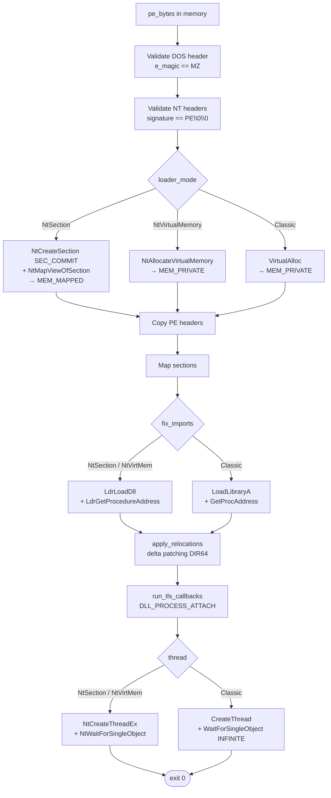

#### Import fix step — NT detail (`NtSection` / `NtVirtualMemory`)

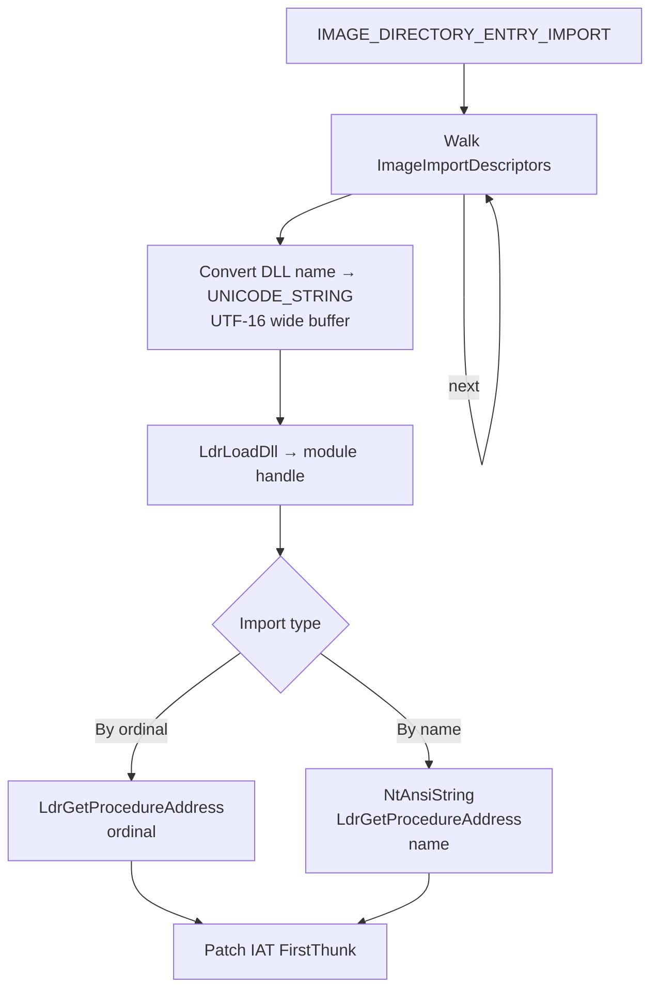

#### Import fix step — Classic detail

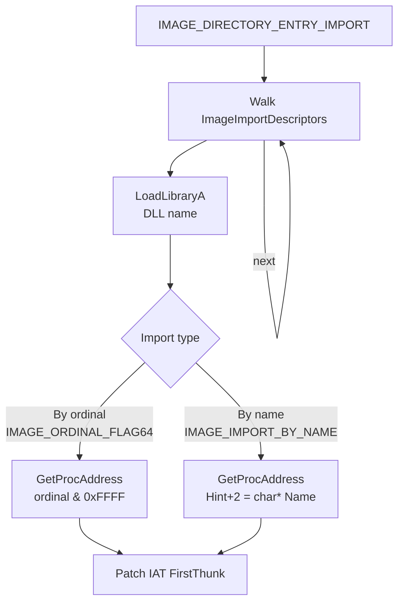

- Fallback: if `OriginalFirstThunk == 0` (MinGW/some linkers), uses `FirstThunk` as source

#### Step 7 — Relocations (`apply_relocations`)

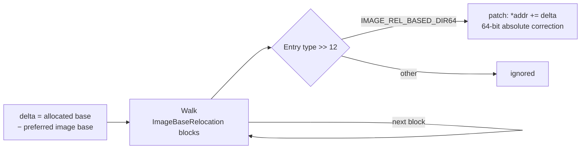

If the PE is not loaded at its preferred `ImageBase`, all absolute addresses encoded in the relocation table are corrected by adding `delta`.

#### Step 8 — TLS Callbacks (`run_tls_callbacks`)

If the PE declares a TLS section with callbacks (`IMAGE_DIRECTORY_ENTRY_TLS`), they are called with `DLL_PROCESS_ATTACH` before launching the entry point — identical behavior to the native Windows loader.

#### Step 9 — Execution

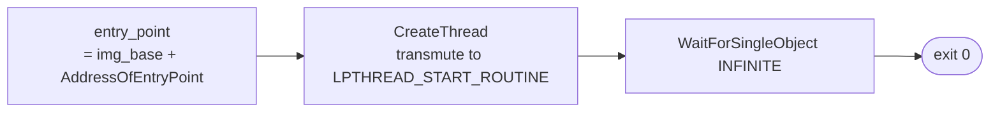

The entry point is launched in a new thread via `CreateThread` (with address `transmute`), the stub waits for it to finish with `WaitForSingleObject(INFINITE)`.

---

### Full packing → execution sequence

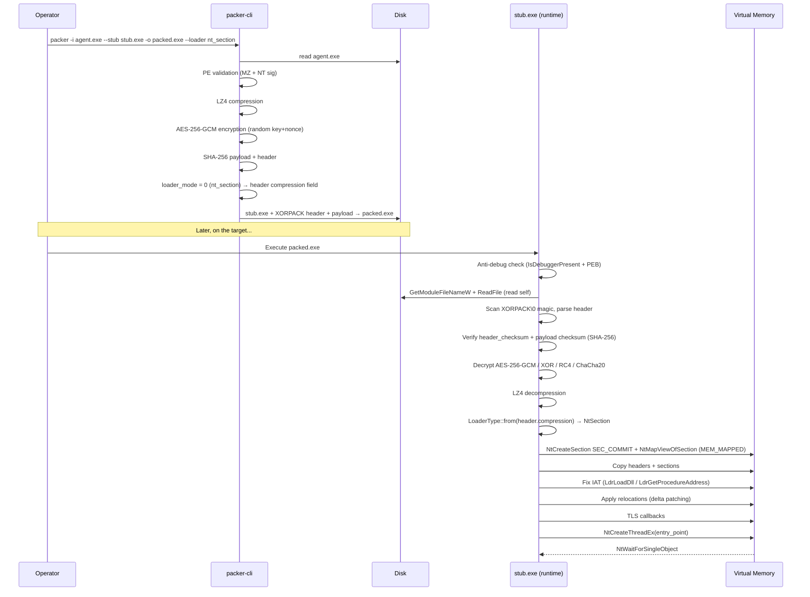

---

## Source Structure

```
packer/
├── packer-cli/          # Packing tool (Rust)
│   └── src/
│       ├── main.rs          # CLI entry point (clap)
│       ├── pe_parser.rs     # MZ + PE signature validation
│       ├── compress.rs      # LZ4 compression (lz4_flex)
│       ├── encrypt.rs       # AES-256-GCM + XOR + RC4 + ChaCha20-Poly1305
│       ├── checksum.rs      # SHA-256 (sha2)
│       └── stub_builder.rs  # Final assembly + header serialization
└── stub/                # Runtime loader (Rust, compiled separately)
    └── src/
        ├── main.rs          # Orchestration: anti-debug → overlay → decrypt → load
        ├── anti_debug.rs    # IsDebuggerPresent + PEB read (x86-64 asm)
        ├── overlay.rs       # File read, magic scan, parse + verify header
        ├── decrypt.rs       # AES-256-GCM + XOR + RC4 + ChaCha20-Poly1305 decryption
        ├── decompress.rs    # LZ4 decompression
        ├── checksum.rs      # SHA-256 compute + verify
        └── loader.rs        # 3 reflective PE loaders: NtSection / NtVirtualMemory / Classic
```

---

## CLI Usage

```
packer --input agent.exe --stub stub.exe --output packed.exe [--encryption aes|xor|rc4|chacha20] [--loader nt_section|nt_virtual_memory|classic]
```

| Argument | Description | Default |
|----------|-------------|---------|
| `-i, --input` | Input PE to protect | — |
| `-o, --output` | Output file | — |
| `--stub` | Pre-compiled Windows stub | — |
| `-e, --encryption` | Algorithm: `aes`, `xor`, `rc4`, or `chacha20` | `aes` |
| `--loader` | Memory loading technique: `nt_section`, `nt_virtual_memory`, or `classic` | `nt_virtual_memory` |

### Examples

```bash
# NT Section loader (MEM_MAPPED, most stealthy)
cargo run -p packer-cli -- -i agent.exe --stub stub.exe -o packed.exe --loader nt_section

# NT VirtualMemory loader (NtAllocateVirtualMemory, avoids EDR hooks on VirtualAlloc)
cargo run -p packer-cli -- -i agent.exe --stub stub.exe -o packed.exe --loader nt_virtual_memory

# Classic loader with RC4 encryption
cargo run -p packer-cli -- -i agent.exe --stub stub.exe -o packed.exe --loader classic --encryption rc4

# NT Section with ChaCha20-Poly1305
cargo run -p packer-cli -- -i agent.exe --stub stub.exe -o packed.exe --loader nt_section --encryption chacha20

# Classic loader with XOR (maximum compatibility)
cargo run -p packer-cli -- -i agent.exe --stub stub.exe -o packed.exe --loader classic --encryption xor
```

---

## Dependencies

### packer-cli

| Crate | Version | Role |
|-------|---------|------|
| `clap` | 4 | CLI argument parsing |
| `aes-gcm` | 0.10 | AES-256-GCM encryption |
| `chacha20poly1305` | 0.10 | ChaCha20-Poly1305 encryption |
| `sha2` | 0.10 | SHA-256 integrity checks |
| `lz4_flex` | 0.11 | LZ4 compression |
| `rand` | 0.8 | Random key/nonce generation |
| `anyhow` | 1 | Error handling |

### stub

| Crate | Version | Role |
|-------|---------|------|
| `aes-gcm` | 0.10 | AES-256-GCM decryption |
| `chacha20poly1305` | 0.10 | ChaCha20-Poly1305 decryption |
| `sha2` | 0.10 | SHA-256 integrity verification |
| `lz4_flex` | 0.11 | LZ4 decompression |
| `winapi` | 0.3 | Windows NT API bindings |
